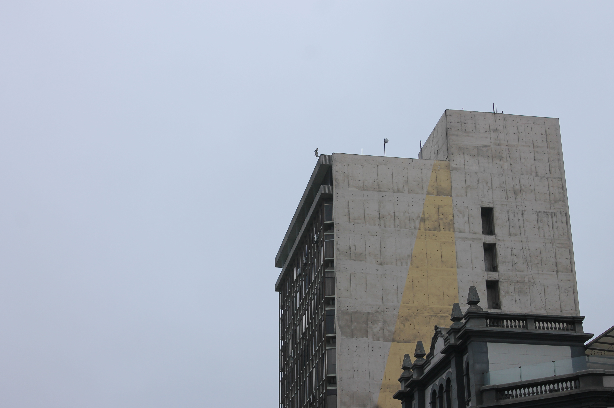

---
# Departure
Benvenuti!

In questo blog proviamo a fare gli [influenzer](https://en.wiktionary.org/wiki/Influenzer). Ce la metteremo tutta. 
Un gentile promemoria del fatto che saremo in Perù, che si trova a CET-7. Siamo 7 ore indietro rispetto all'Italia.

## Pre-flight checklist
Oggi non c'è molto da dire, abbiamo iniziato le 20 ore di viaggio necessarie per arrivare a Lima.

Per ora nella nostra checklist abbiamo: 
✅ Pisolo in macchina nella tratta Modena-Bolo.  
✅ Check-in per Madrid.  
✅ Check-in per Lima.  
✅ Panino spugnoso con la mortazza a 8EUR.  
✅ Attesa di 3h seduti su quei curiosi tubi orizzontali ai piedi delle vetrate. [Qualcuno sa a che cosa servono](https://chatgpt.com/share/871a6d9f-1369-4c9a-a376-e0b0f6c90efd)? Non sono molto comodi ma noi siamo contenti lo stesso.

Mood: signore che si regge la fronte in presa alla disperazione più selvaggia.

## Madrid
Ore 21:45 arrivo all'aeroporto di Madrid. 
Ore 22:44 limite di sopportazione dell'Elisa per qualsiasi forma di vita.  
Da ora in poi ogni evento è un ottimo motivo per scatenare una rissa. 

***
## Lima
Ore 05:09 arrivo all'aeroporto di Lima.  
Vedere una città che si sveglia è sempre un privilegio.  
Il clima di oggi è invernale, quindi niente bikini.

#### Curiosità del giorno
Più del 50% dell'acqua che beviamo ha la stessa età del sole.
#### Fatto del giorno
Giacomo Leopardi andava matto per i dolci. Si dice che il proprietario di una pasticceria di Napoli abbia comprato un titolo nobiliare con il denaro guadagnato dal poeta.
