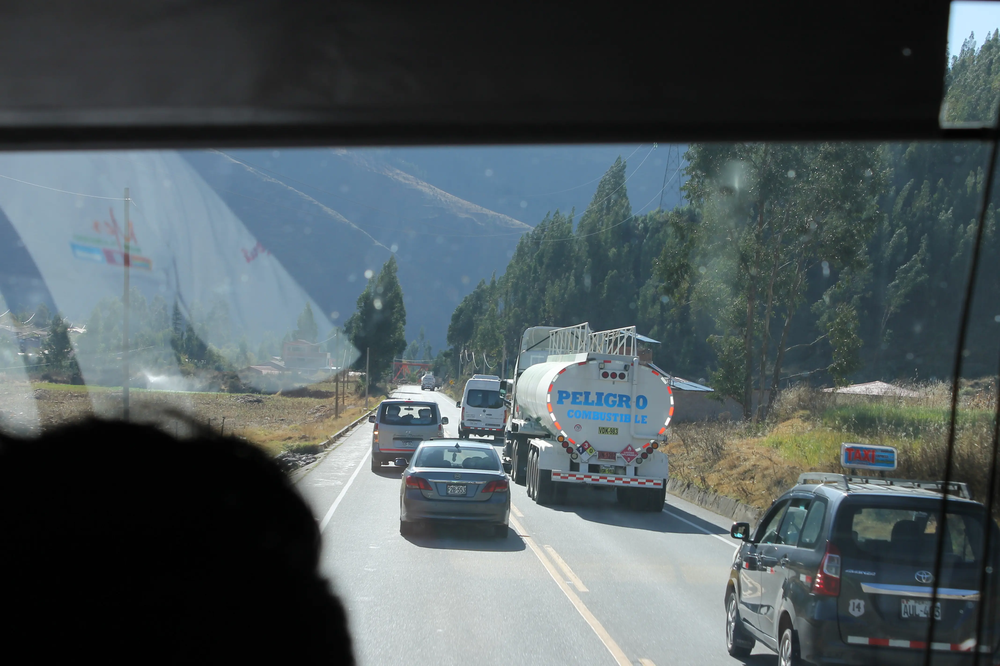
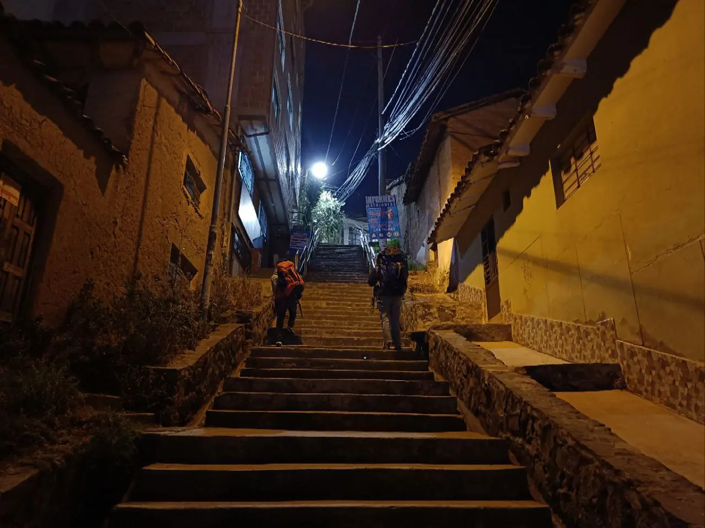

---
# Giorno 10 - Esodo
Inaspettatamente, sveglia alle 5:15 stamattina:

Alle 6:15 abbiamo il bus per Cusco, la più antica città del sudamerica.
Incontriamo Marco, la nostra guida per oggi, e Wilbert, che successivamente rinomineremo Kasparov. Si capirà dopo il perchè.

Lasciamo Puno e partiamo alla volta della città sacra, con un modestissimo viaggio di 10 ore, in cui faremo varie fermate. Qui ne riporteremo 3.

## Tappa 1 - il torello
Oggi il paesaggio è nuovo:

e la strada è lunga:

Quel blob sfuocato in basso sono i capelli di Kasparov, che ha adottato lo stile Elvis oggi.

La prima tappa si chiama Pukara; di questo paesino non abbiamo molto da dire, se non che sono famosi per i [piccoli tori in ceramica](https://es.wikipedia.org/wiki/Torito_de_Pucar%C3%A1) che rappresentano la fertilità:

A qualcuno potrebbero anche ricordare i personaggi di una certa serie che ha come protagonista una certa [pecora](https://www.youtube.com/watch?v=cj_FlzcDwU8).

## Tappa 2 - la vetta
Dopo qualche ora raggiungiamo il confine fra la regione di Puno e quella di Cusco, chiamato il Passo de la Raya:

Da qui vediamo in monte Kunka, e il suo (non più cosi grande 😔) ghiacciaio:

Entrando nella regione, Marco ci dice che quando il sole è in una certa posizione, le colline cantano:

## Tappa 3 - il frigorifero
Dopo il pranzo, sponsorizzato dalla bevanda degli dei, la Inca Kola:

Ci fermiamo a vedere la cominutà di [Raqch'i](https://en.wikipedia.org/wiki/Raqch%27i), un sito archeologico contenente alcune rovine di epoca inca. Ci vogliamo soffermare su alcune strutture molto particolari, chiamate colca (*termine familiare??*):

I colca erano degli antichi silos circolari in cui veniva stoccato il raccolto. La forma circolare favoriva l'ingresso del vento e la formazione di tanti piccoli [Eddy](https://chatgpt.com/share/99abec8a-f4f8-4c66-bba8-352f7455d8ad) che mantenevano fresco il contenuto della colca. Dei frigoriferi naturali! Nella foto possiamo anche ammirare Marco mentre si accinge a spiegarci tutto ciò.

Nel Cañon del Colca (Episodio 7) sembra siano state ritrovate delle rovine simili, da lì il nome.

Nel medesimo sito possiamo anche ammirare un antico tempio alla Pacha Mama (la madre terra):

## Piccolo intermezzo
Dopo vari giorni, siamo convinti di aver carpito alcune delle regole della strada fondamentali, dunque riteniamo doveroso condividerle con voi.  
Perdonate la qualità delle fotografie.

Per quanto sembri che il Perù abbia un codice della strada ragionevolemente standard, abbiamo notato alcune anomalie. Eccone 3:
### The Queen's Gambit
Per nessuna ragione specifica, e senza nessun pattern temporale, il senso di marcia delle corsie si inverte. Dalla corsia di destra si passa a quella di sinistra, come in Inghilterra:

A volte può capitare (come in questo caso) che gli altri conducenti non siano al corrente dello scambio. 
Ah, notate nulla di strano nella foto?

### En passant
In questo caso, più autovetture effettuano un sorpasso, più efficace è la strategia:

Ci può essere l'en passant singolo, ma anche il doppio:

### Zugzwang
Detta anche "il sandwich peruviano", questa manovra consiste nel transormare la strada da 2 a 3 corsie, riassegnando arbitrariamente i sensi di marcia:

Questa manovra è da sconsigliare a chiunque non abbia conseguito una patente di tipo Q o superiore.

## Cusco
Finalmente arriviamo a Cusco, al calar del sole:

Non è il sole, è un lampione.

Stanotte alloggiamo in una delle strutture supportate da [Perù Responsabile](https://www.peruresponsabile.it), [Casa Caith](https://yanapanakusun.org/casa_caith/). Qui si promuove l'autonomia e la formazione delle ragazze che vengono da comunità o villaggi in cui l'educazione non è facilmente accessibile. 
Più info [qui](https://yanapanakusun.org/).

Per raggiungere la struttura dobbiamo affrontare un vecchio nemico; le scale:

Cusco è a 3400 m, ma ormai noi siamo Sherpa navigati.

A domani, buonanotte (ore 21:30 locali).

## Bonus
L'Elisa dentro un frigo:

#### Curiosità del giorno
Il nome dei famosi diagrammi di Feynman \"pinguino\" si deve ad una scommessa persa da John Ellis al bar, il quale fu costretto ad inserire la parola \"pinguino\" in una sua presentazione.
#### Fatto del giorno
Quando a Vittorio Alfieri non aveva voglia di scrivere, si faceva legare alla sedia da un servitore con la minaccia di non essere liberato fino ad opera ultimata.

