---
# Giorno 11 - Sinceramente non lo so
Oggi lusso, sveglia alle 6:30!
Dopo una ricca colazione, in cui abbiamo assaggiato la Chirimoja e abbiamo mangiato l'avocado più buono della nostra vita, incontriamo Alicia e Edison, che saranno i nostri ciceroni di oggi.

## Chinceramente
Ci avviamo alla volta di Chincero (pronuncia "cincero"), in cui visitiamo un hermoso centro tessile. Qui impariamo tutti i segreti dei coloranti naturali:
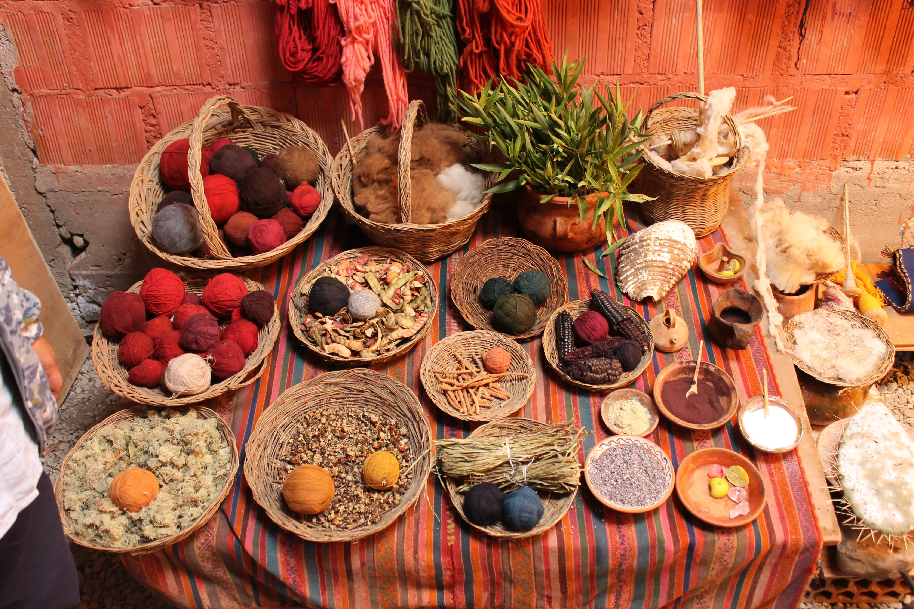

Ma soprattutto incotriamo alcuni animaletti che non avevamo ancora visto, i Cuy:
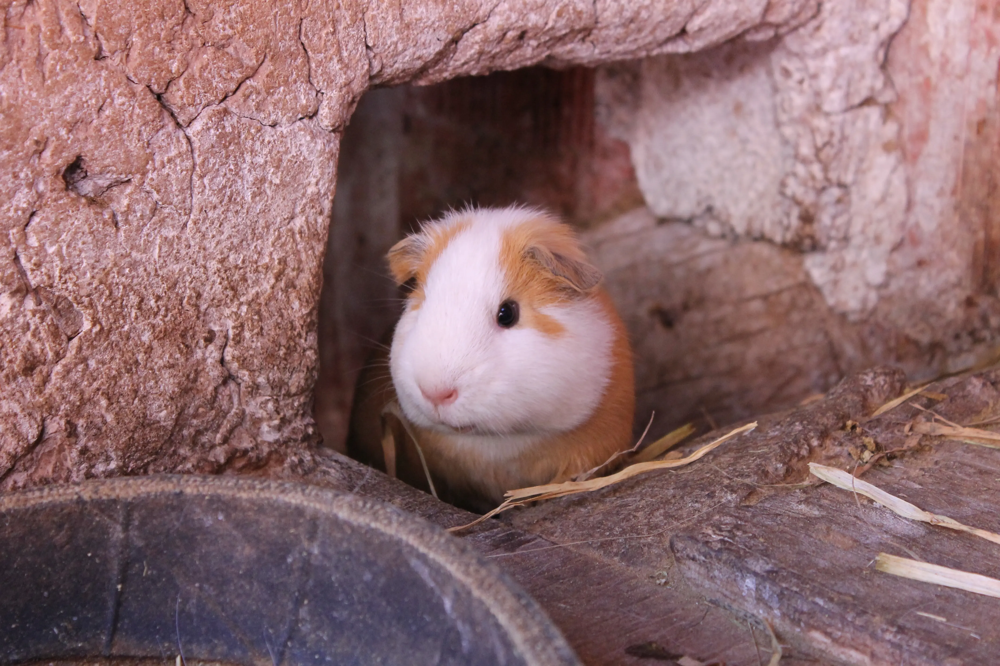
Cioè i porcellini d'india! Qui li mangiano, ma noi li ammiriamo e basta.

La prossima tappa un sito archelogico inca molto famoso:
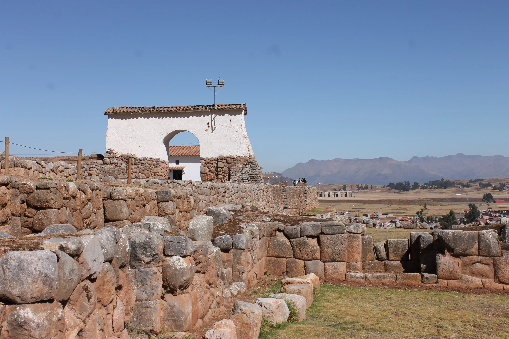
Alicia ci racconta che durante l'occupazione spagnola, iniziata nel 1532, la cultura e l'architettura indigena venivano re-immaginate secondo lo stile occidentale. Questa manovra si puù vedere molto bene nella immagine precedente, in cui viene costruito un arco sulla base di un muro di epoca inca. 

Ci piace osservare che nonostante gli sforzi spagnoli, il popolo peruviano mantiene ad oggi una identità e una tradizione forti, molto forti.

A Chincero cominiciamo a intuire quale sia l'invenzione più grande degli inca: i terrazzamenti.
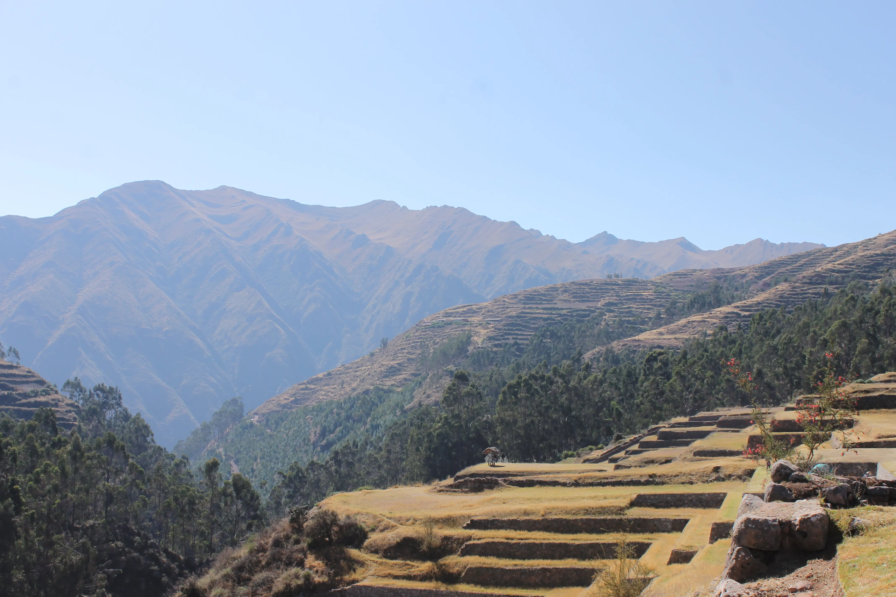
Poter coltivare in modo efficace ad altitudini estreme e in un ambiente ostile come quello delle Ande non è facile, tantomeno 1000 anni fa. 
Ci torneremo sopra più tardi, perchè la genialità di questo popolo non finisce qui.

## Sale
Nel giretto di oggi, facciamo tappa alle saline di Maras:
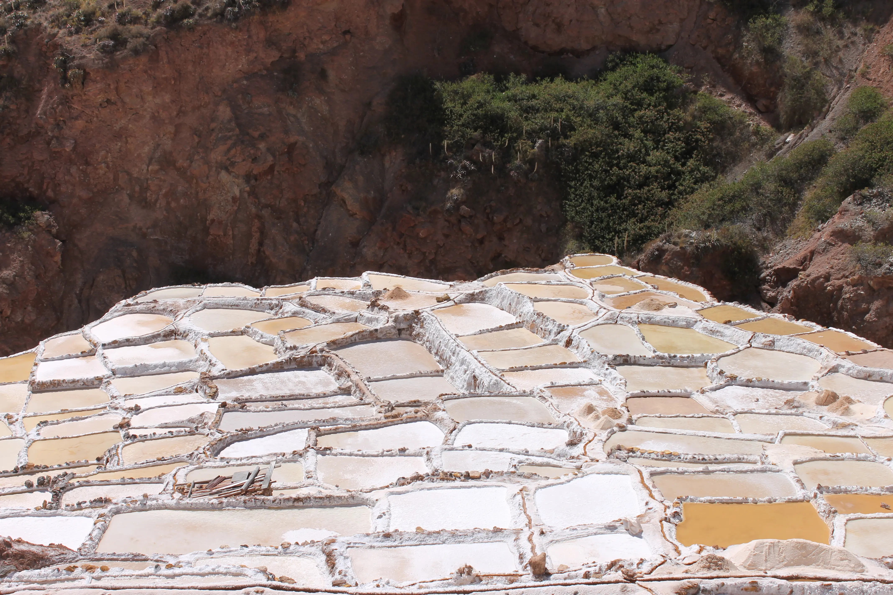
Queste saline risalgono all'800 a.C. e contengono più di 4000 piscine utilizzate per, indovinate un po', la produzione di sale:
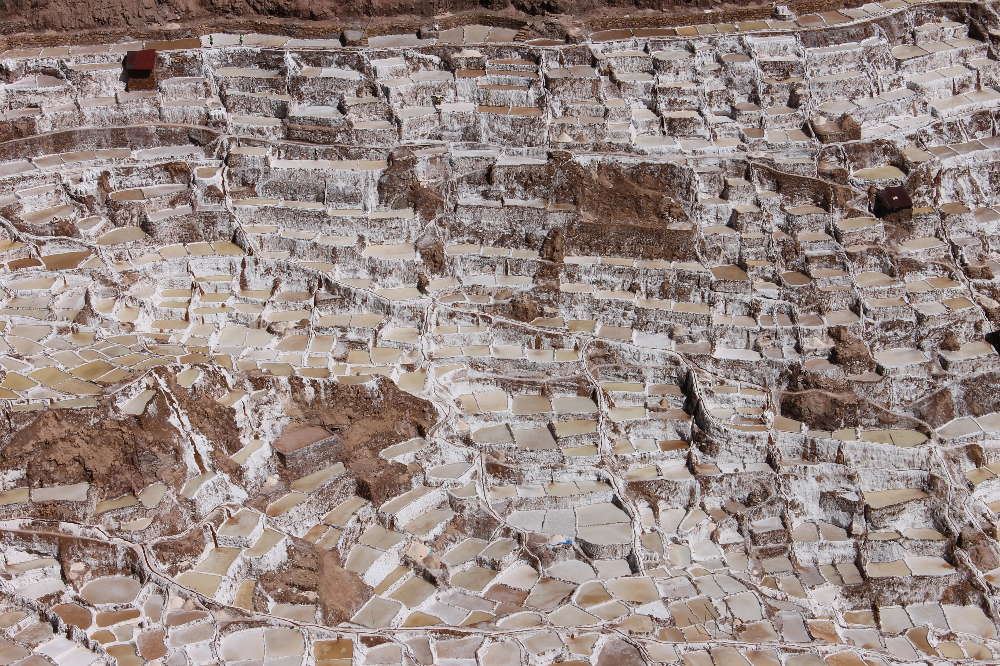

Ogni piscina viene riempita di acqua salata, che poco a poco evapora. Quando della piscina ci sono 10cm ci sale accumulato, arriva un signore che inizia a smazzuolarla per compattare i fiocchi di sale:
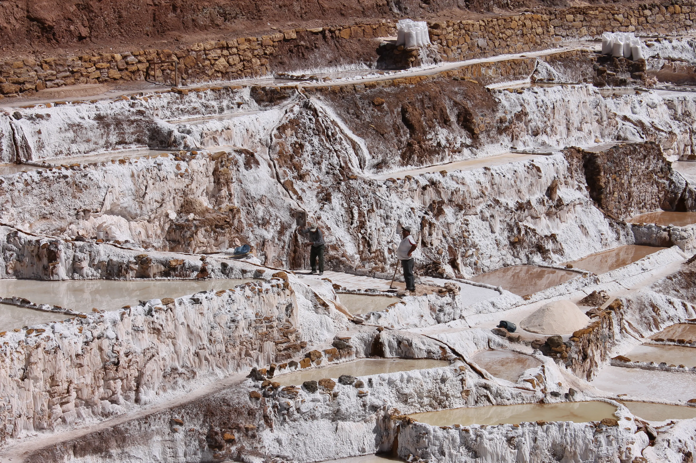
Dopodichè il suo compare, munito di apposito attrezzo, racimola tutto il sale in un sacco. 
A questo punto i sacchi da 50kg vengono stoccati da un gruppo di arditi:
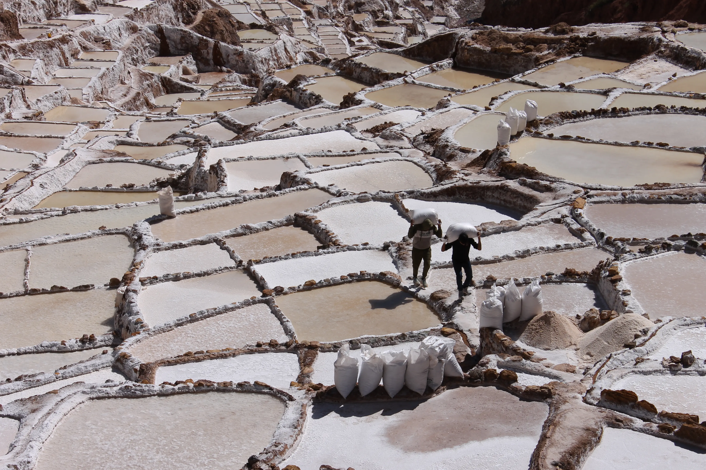
Et voilà.

## Moray
Torniamo alla questione agricoltura: il trip di oggi prevede una sosta al sito di Moray.
A Moray troviamo questo:
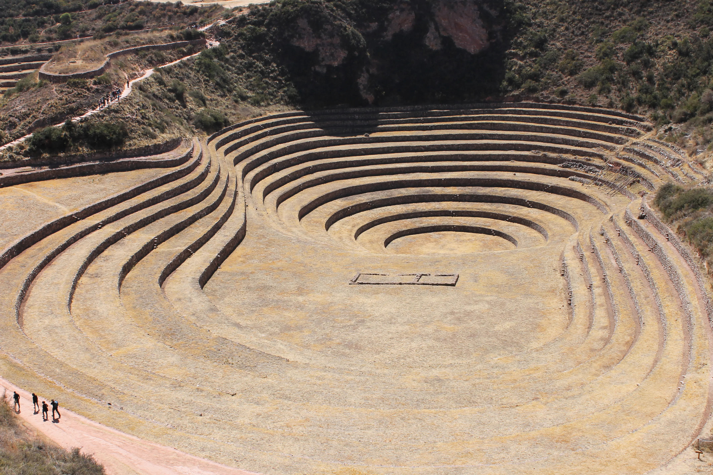
No, non è un afiteatro! Alicia ci rassicura dicendo che anche i maggiori esperti avevano pensato ad una sorta di Colosseo inca la prima volta che lo hanno visto; in realtà questo complesso è un gigantesco laboratorio agricolo.

Sfruttando la posizione e la topologia del posto, quei bomber degli inca hanno costruito una serra naturale. Ogni terrazzamento ha un microclima diverso, con temperatura, umidità e tipo di suolo differente.  
Grazie a questa gigantesca infrastruttura, gli agronomi inca hanno sperimentato una infinità di raccolti differenti, creando anche nuove specie vegetali. Assurdo.

Ecco l'Elisa che si fa un giro in uno dei piccoli complessi circostanti:
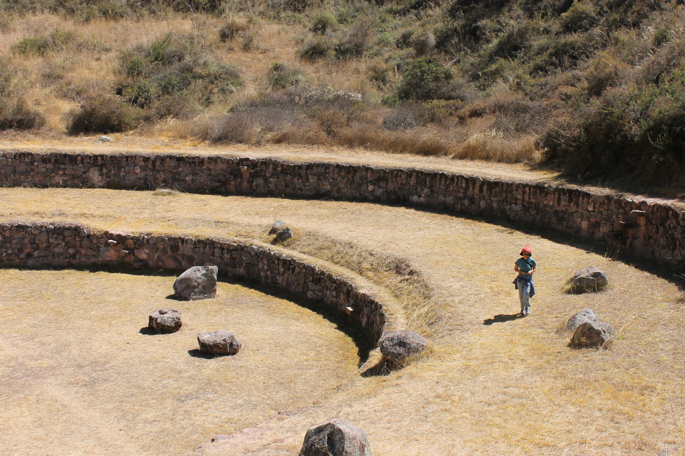

## Ollaintaytambo
L'ultima tappa di oggi si chiama Ollaintaytambo. Gente, qui si torna a scalare:
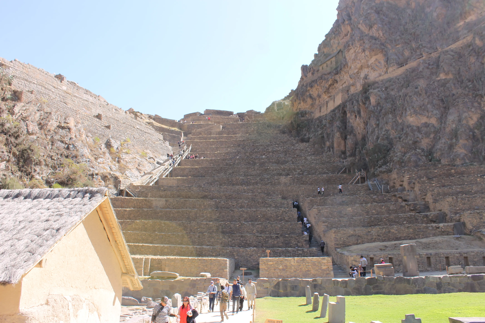
Prima che pensiate "on no, ancora terrazzamenti agricoli" vi fermiamo; questo complesso ha un singolo scopo: creare una base stabile per la costruzione di un tempio dedicato al Sole. Questo tempio però non venne mai costruito. Quando vi sentite inutili, pensate ad Ollaintaytambo.

Cionondimeno, tutta questa baracca è spettacolare. 

Vorremmo attirare l'attenzione su un dettaglio che potrebbe sfuggire all'occhio inesperto (tipo il nostro):
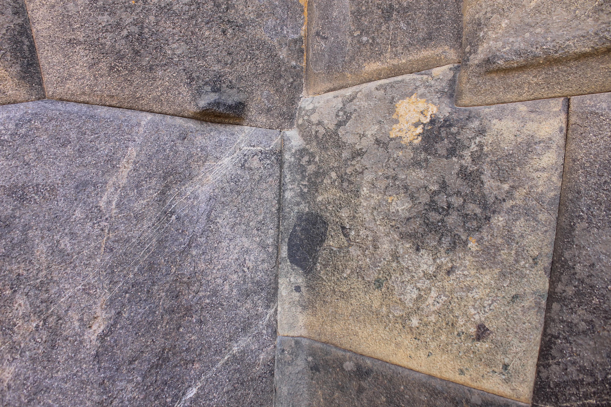
Questi massi giganti sono posati a SECCO (cioè senza malta) e la precisione con cui sono tagliati è da fuori di testa. 
Date una occhiata al masso con la macchia gialla, fa la CURVA ALL'ANGOLO!

Ancora più assurdo: in cima troviamo questi sassi giganteschi, che pesano 30-40 tonnellate l'uno:
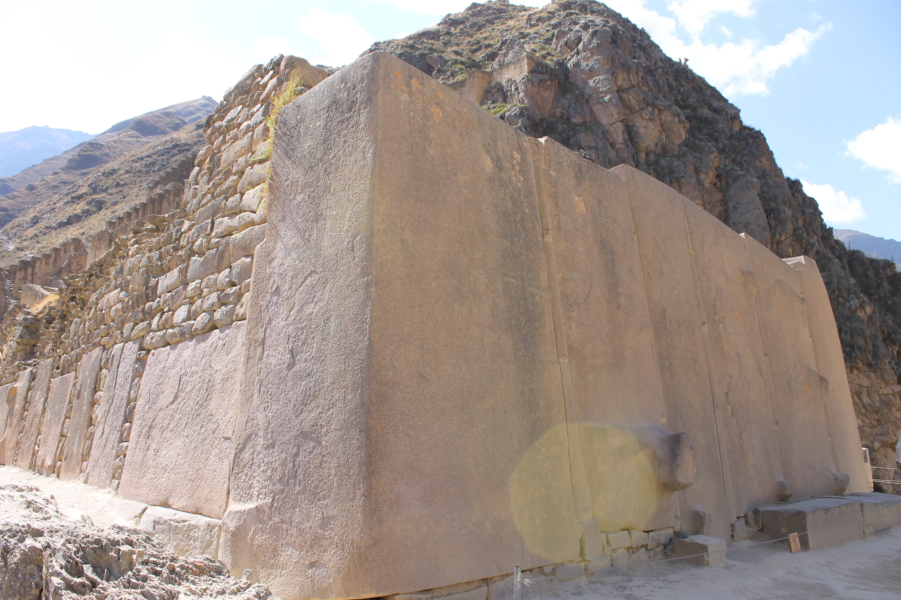
Ma la cosa incredibile è che la pietra proviene da una cava distante 9 km da dove sono i massi.

Chiudiamo in bellezza con questa: di fronte al complesso principale c'è una montagna:
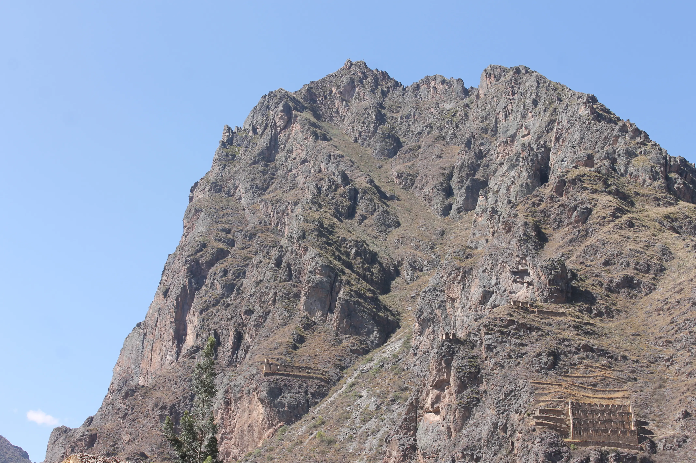
Quelli in basso a destra sono dei colca, che conosciamo già bene. Ma se controllate meglio alla sinistra dei colca, potreste notare una formazione rocciosa simile alla faccia di un vecchio arrabbiato:
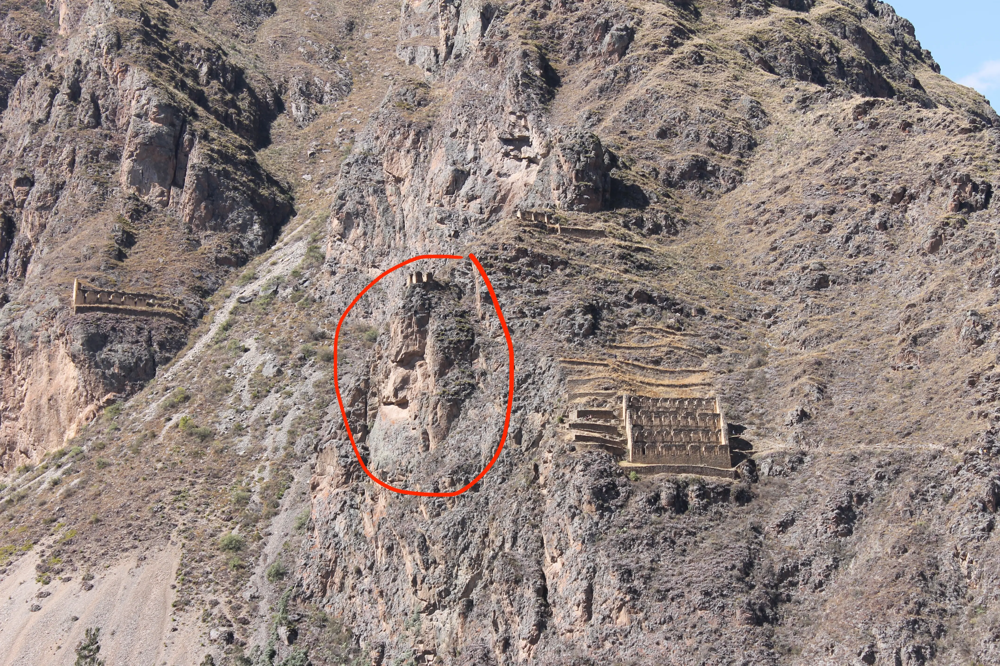
La montagna [Pinkuylluna](https://en.wikipedia.org/wiki/Pinkuylluna) era considerata sacra, talmente sacra che gli era spuntata una faccia.

Basta epicità per oggi. Alle 16:47 prendiamo il treno per arrivare a Machu Picchu, e dopo 1 ora e 30 di viaggio che ci è sembrato come andare in monopattino sui sanpietrini, eccoci arrivati:

Si, il binario è in mezzo alla strada.

Prendiamo 4.5kg di riso alla cantonese, e andiamo a letto.

A domani, buonanotte (ore 19:47 locali).

## Bonus
Oggi ne abbiamo vari, fra cui la foto di un mattone con Giovanni vestito da Indiana Jones dietro:
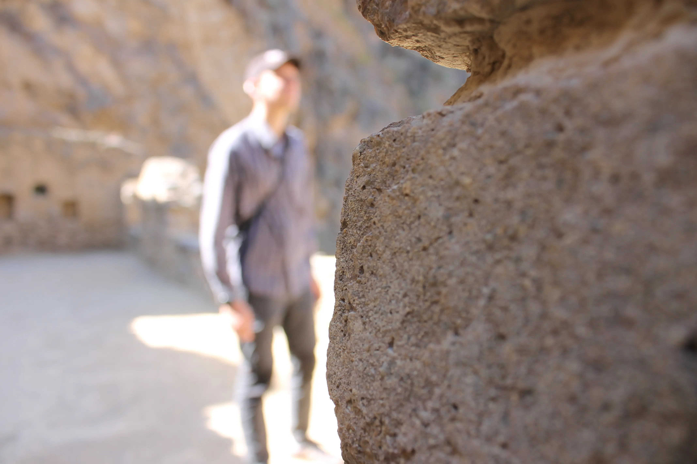
L'Elisa che finalmente trova un gattino (che ora è nel suo zaino):

E infine un tipo di patata che da tradizione viene utilizzata prima di un matrimonio: la sposa la deve pelare tutta in un solo movimento (la pelle deve essere un solo pezzo) davanti alla famiglia dello sposo che guarda:
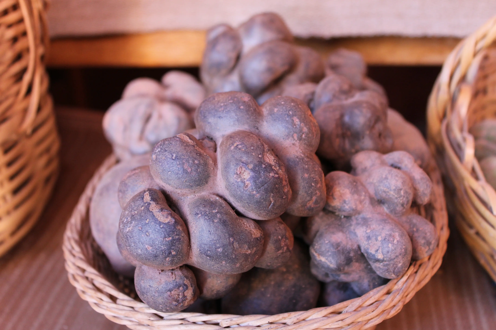

#### Curiosità del giorno
In qualunque momento, il gamma ray burst proveniente da una supernova può raggiungere la terra e cancellare istantaneamente ogni forma di vita :)
#### Fatto del giorno
Virginia Woolf preferiva scrivere utilizzando l'inchiostro viola. Si dice che questo colore la rilassasse e stimolasse la sua creatività.

