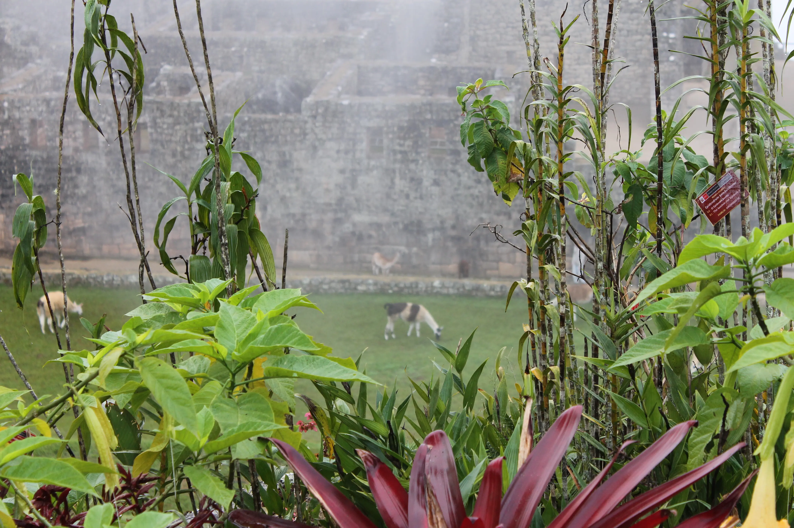
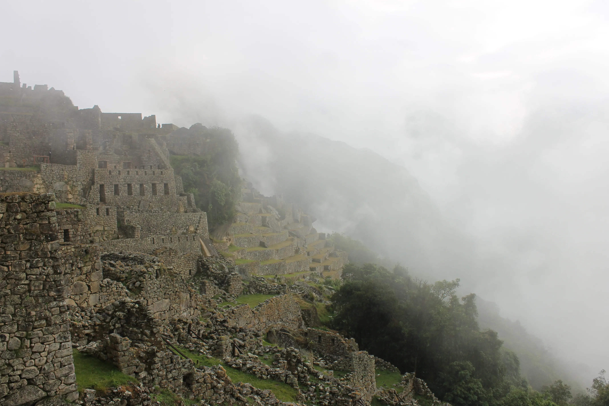

---
# Giorno 12 - Machu Pi(ka)cchu
Sveglia alle 4:45 oggi, per andare in uno dei siti più visitati al mondo.
La cantine dell'hotel è illuminata a metà perche solo noi stiamo facendo colazione alle 5:00.

Alle 5:30 arriva la nostra guida, Juan. Juan stanotte non ha dormito perchè un suo cugino si è sposato ieri e ha fatto festa fino a pochi minuti prima di vederci. 
Ma non temete, questa giornata sarà divertente.

## El bus
Saliamo a bordo del bus con il buio, insieme ad un'altra tonnellata di visitatori. Il viaggio è strano: non c'è ancora il sole, i vetri sono appannati dal calore degli occupanti del bus e dall'umidità del clima tropicale di Aguas Calientes, da dove siamo partiti.
Non si vede nulla, solo i fari del pullman che sfiorano la vegetazione mentre infiliamo un tornante dietro l'altro. 

Ad un certo punto ci fermiamo, siamo arrivati.

Piove.

Ci sono nuvole ovunque:

Sembra di stare in pianura padana.

Juan ci dice di non preoccuparci, ci dice che abbiamo avuto fortuna. Ci mettiamo l'impermeabile e superiamo le folle di visitatori in maglietta e pantaloncini che aspettano sotto la tettoia. Siamo solo noi 3, che ci arrampichiamo sulle scale.

Tutto ad un tratto scorgiamo qualcosa, nascosta nelle nuvole:

La storia di [Machu Picchu](https://it.wikipedia.org/wiki/Machu_Picchu) (pronuncia "macciu pik-ciu") è nota: venne costruita fra il 1400 e il 1500, ma non venne mai terminata. Le uniche persone che vissero li furono gli operai addetti ai lavori.

La città non venne mai scoperta dai conquistadores. Un signore chiamato Hiram Bingham la scopri nel 1911 grazie ad un ragazzetto locale di nome Pablo, per gli amici Pablito.

Siamo completamente soli nel sito più visitato del Perù, e le nuvole cominciano a diradarsi:

Entriamo nella città:

Mentre camminiamo, incontriamo uno degli abitanti, che si solito non si vede mai:

Juan ci dice che questi [chinchilla](https://en.m.wikipedia.org/wiki/Machu_Picchu_arboreal_chinchilla_rat) abitano a Machu Picchu, ma non gli piacciono i turisti.

Ci addentriamo nella città:

Da qui possiamo vedere la piazza principale, le abitazioni degli operai sulla destra, e il tempio in alto:

Fra la vegetazione, scorgiamo anche alcuni dei 25 giardinieri, che contribuiscono a tenere l'erba rasata:

E torreggiante sullo sfondo, il monte Huayna Picchu:

Continuiamo a camminare:

Questa atmosfera, e il privilegio di essere soli, ci piacciono:

Questa città è a 2400m, e il paesaggio è molto diverso da quello dei giorni scorsi:

Questa vegetazione è il principio della foresta pluviale, chiamato dai locali "il sopracciglio della foresta".

Ormai non ci sono più tante nuvole, ci giriamo e li vediamo, come tante formiche:

Aspettano, cosa non si sa. Ma meglio per noi 😁, che intanto stiamo dando un'ultima occhiata ai terrazzamenti:

Ci sembra che il tempo di oggi sia quasi meglio di una giornata di sole:

Ci prepariamo ad uscire, ma Juan non la pensa come noi. 
Juan vuole che vediamo questa città con un po' di sole.

Ci dirotta infatti su un' altro percorso, senza che nessuno ci veda. Rientriamo:

Stavolta con più turisti, ma noi siamo contenti lo stesso. 
Con più sole e un po' meno nuvole, c'è una bella atmosfera:

Continuiamo a passeggiare e vediamo alcune scale costruite dagli inca, ed altre costruite dagli inca-paci:

No, non l'abbiamo inventata noi, c'è l'ha detta Juan.

Rincontriamo anche i famosi muri inca. Notiamo un mattone un po' sporgente:

Siamo quasi sicuri che premendolo si apra una qualche stanza segreta, ci proviamo stanotte.

Vediamo i giardinieri più da vicino:

Prima di uscire, andiamo ancora in po' in giro:

Finiamo il tour alle 9, e ritorniamo ad Aguas Calientes.

Facciamo un piccolo giro per la città per poi andare verso la stazione:

Per la serie mitologia inca, incontriamo un'altra statua:

Riprendiamo quel delizioso treno per Ollantaytambo, e poi un bus che in 2 ore ci riporta a Cusco. 

Facciamo un giretto per le vie del centro (non spoileriamo la puntata di domani), mangiamo qualcosa, e a letto. 
A domani, buonanotte (ore 22:00 locali).

## Bonus
Non potevamo non trovare una mascotte per oggi:

#### Curiosità del giorno
Se si mette insieme tutta la musica mai prodotta (fino ad oggi), si ottengono circa 230 anni.
#### Fatto del giorno
Ernest Hemingway non diceva mai di no ad un daiquiri.

