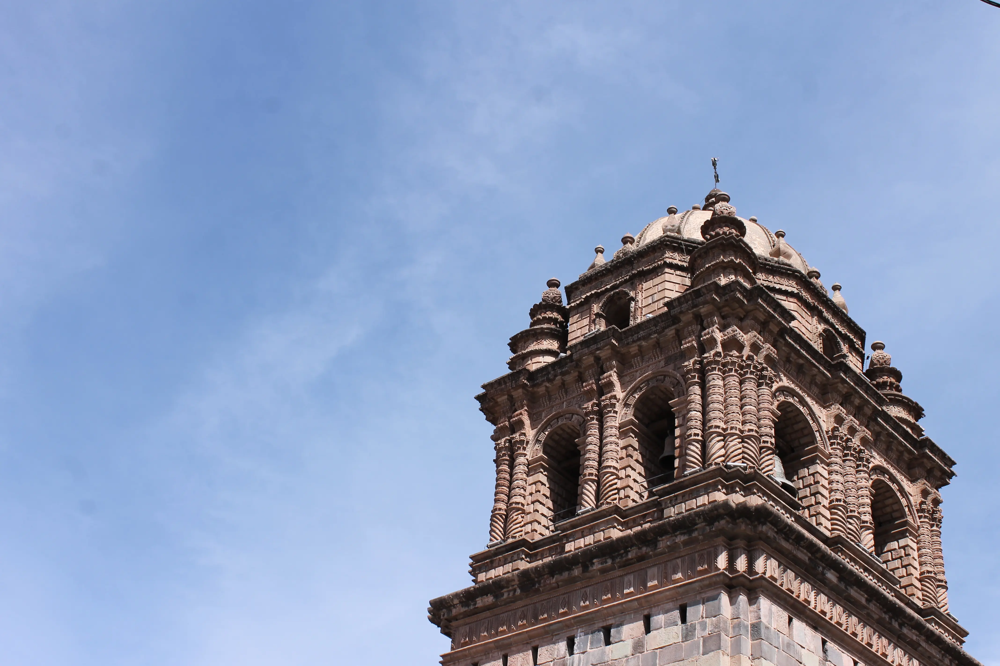

---
# Giorno 13 - L'ombelico del mondo

Oggi esploriamo Cusco.
Siccome è domenica, sveglia tardi alle 7:10.

Siamo belli cotti, ma abbiamo ancora le energie per visitare qualche sito archeologico.

## La testa del Puma
Con Alicia andiamo subito fuori Cusco, a [Saqsaywaman](https://it.wikipedia.org/wiki/Sacsayhuam%C3%A1n) (che significa "il luogo dove i falchi si saziano"), una fortezza cerimoniale che veniva e viene ustilizzata per la celebrazione della festa del Sole, il 21 Giugno.

Alicia ci porta qua:

Non sembra ci sia molto, ma poi scopriamo un passaggio nella montagna:

Nell'antichità c'erano moltissimi di questi cunicoli. La maggior parte vennero sigillati, dal momento che le persone che vi si avventuravano dentro uscivano vaneggiando di aver visto cose assurde.

Il tunnel rimasto aperto ci conduce in uno spiazzo circolare, che una volta era un bacino d'acqua:

L'acqua veniva raccolta li e utilizzata sia per le coltivazioni che per le cerimonie. Noi siamo estasiati, e crediamo che sia finita lì.  Ma poi, appena dopo una collinetta, ci accorgiamo del vero sito archeologico:

Quello che più ci colpisce è la grandezza delle pietre trasportate da una cava a oltre 7km di distanza, che arrivano a pesare 200 tonnellate, come questa:

Da qui abbiamo anche una vista chiara di Cusco:

Sconfinata.

Alicia ci spiega anche che Saqsaywaman ha un altro significato. La città vecchia di Cusco era stata costruita per avere la forma del corpo di un puma, e il posto in cui siamo noi adesso ne rappresenta la testa:

## La Fortezza Rossa
Risaliamo in macchina e andiamo a Puka Pukara (letteralmente "La Fortezza Rossa"): questo sito era una stazione militare.

Serviva come punto strategico per la regolazione dei viaggiatori che andavano da e verso Cusco. 
Era senza dubbio la più importante, ma non l'unica. Infatti, vediamo un'altra stazione in alto, sulla montagna:

Nel vertice della "v", si riesce ad intravedere un'altra rocca. Se fosse stato necessario dare l'allarme, i soldati in Puka Pukara avrebbero mandato dei segnali all'altra stazione, che a sua volta avrebbe fatto lo stesso con la stazione successiva, e così via.  
Esattamente come in [questa scena](https://www.youtube.com/watch?v=i6LGJ7evrAg).

## Q'enqo
Facciamo un'altra tappa in questa rovina, che consiste in un complesso di caverne dedicate ai sacrifici (non umani eh):

## Back to Cusco
Tornati a Cusco, ci fermiamo nella piazza maggiore:

E assistiamo alla parata domenicale; solitamente è una parata militare, ma oggi abbiamo anche gli alunni di alcune scuole e collegi. 

Continuiamo il nostro giro per la città, e scorgiamo un paio di altri bonus, come la pietra dai 12 angoli:

E facciamo una foto artistica alla torre della Basilica Menor de la Merced:

[Pranziamo](https://maps.app.goo.gl/MR54bmD7qpnZvrj58) e ci dirigiamo verso i nostri bagagli, perchè stasera voliamo a Lima, e domani mattina presto lasciamo il Perù.

Arrivati in aeroporto, ci imbarchiamo e decolliamo. 
Ci godiamo il tramonto:

Arrivati a Lima, facciamo check-in, mangiamo qualcosa, e a letto. 
A domani, buonanotte (ore 21:41 locali).

## Bonus
No bonus oggi, siamo cotti a puntino. Ciao <3

#### Curiosità del giorno
Una manciata di materia presa da una stella di neutroni pesa come il monte Everest.
#### Fatto del giorno
Mark Twain è nato il giorno in cui è caduta una cometa e ha predetto che sarebbe morto alla sua prossima apparizione. E così fu.

