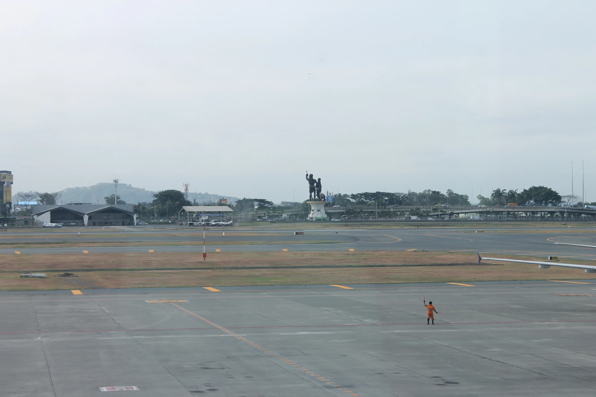
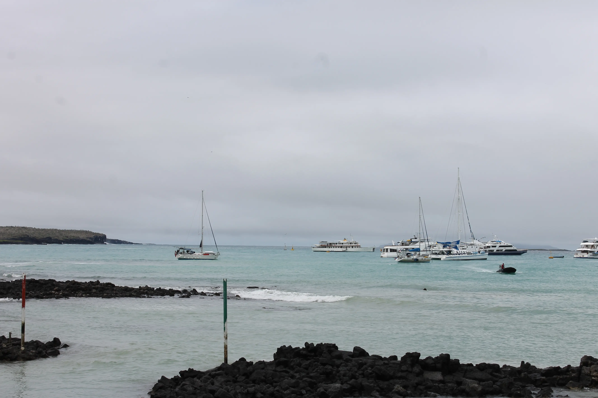
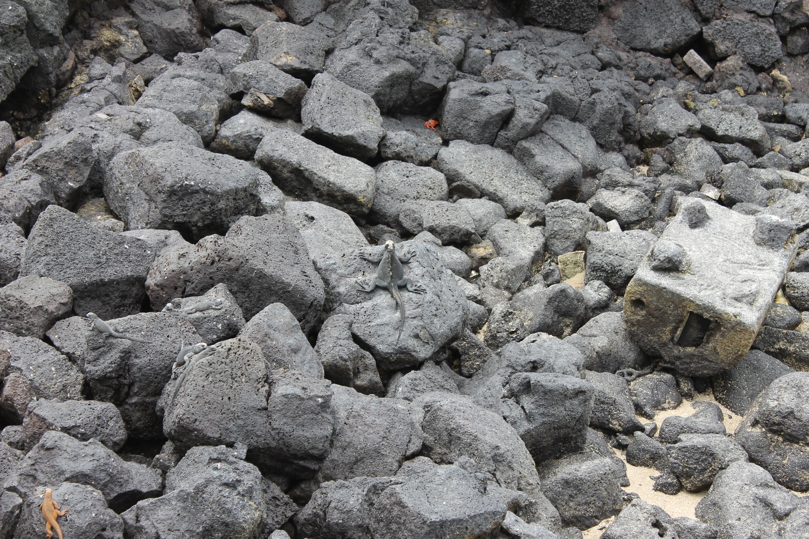
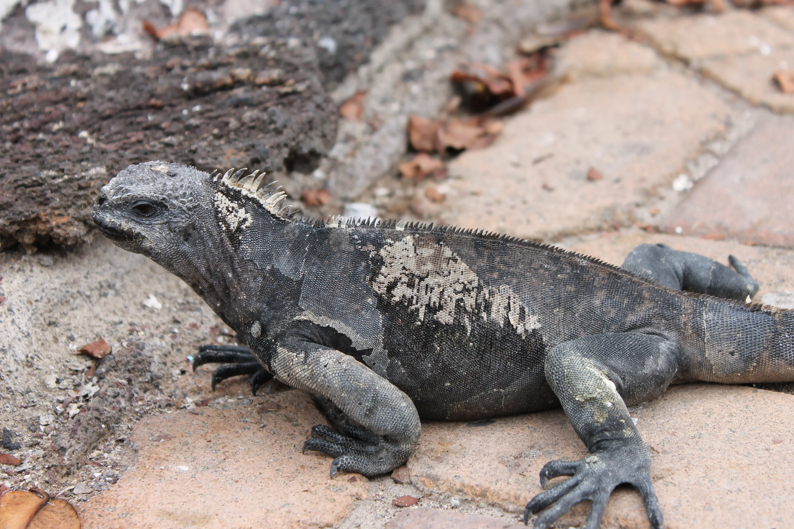
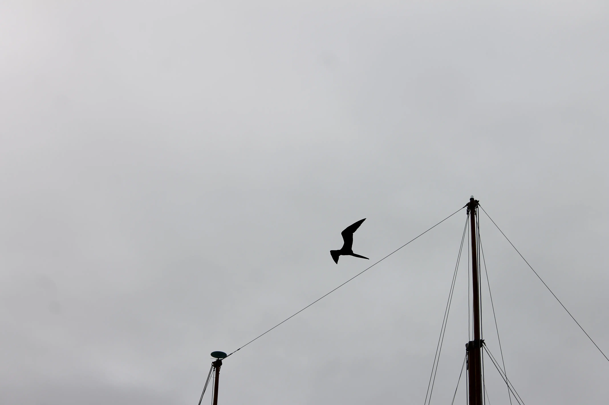
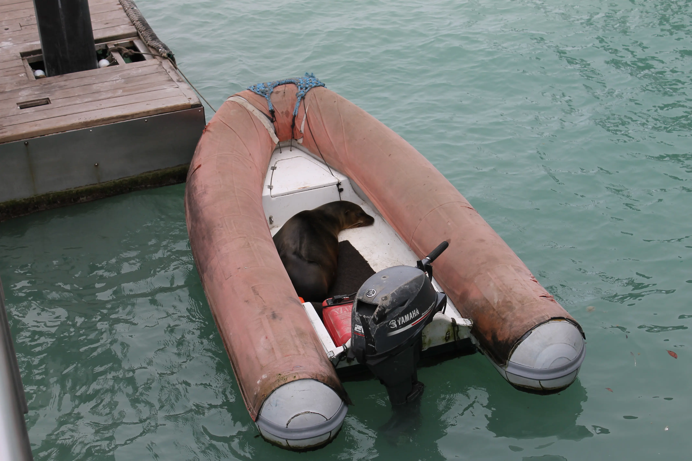
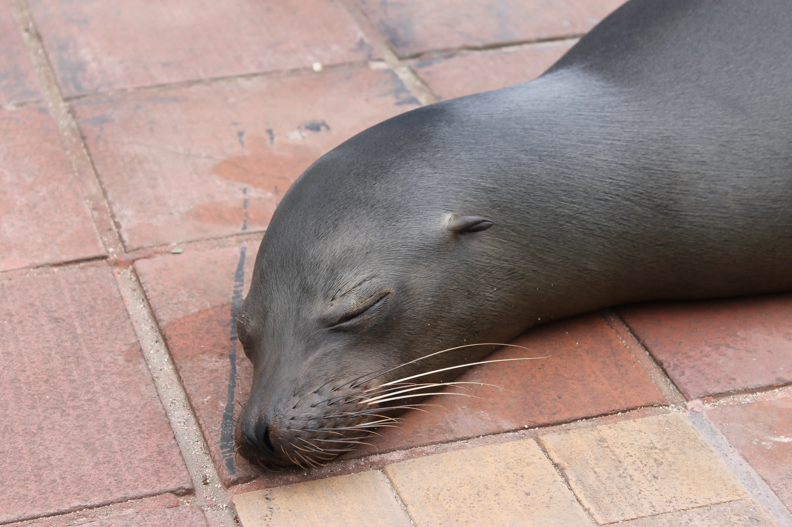
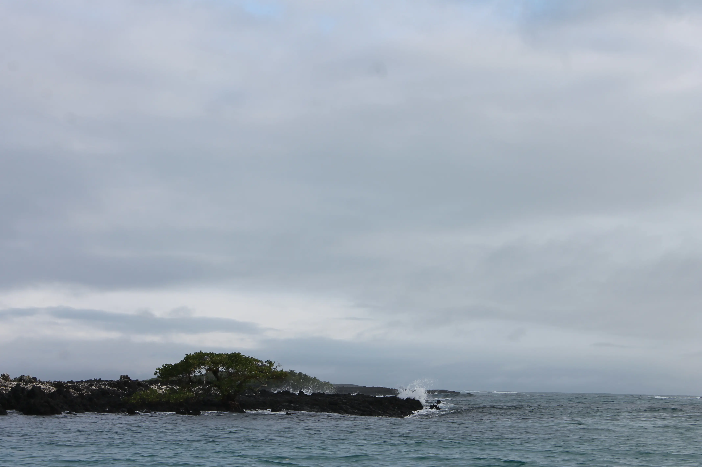
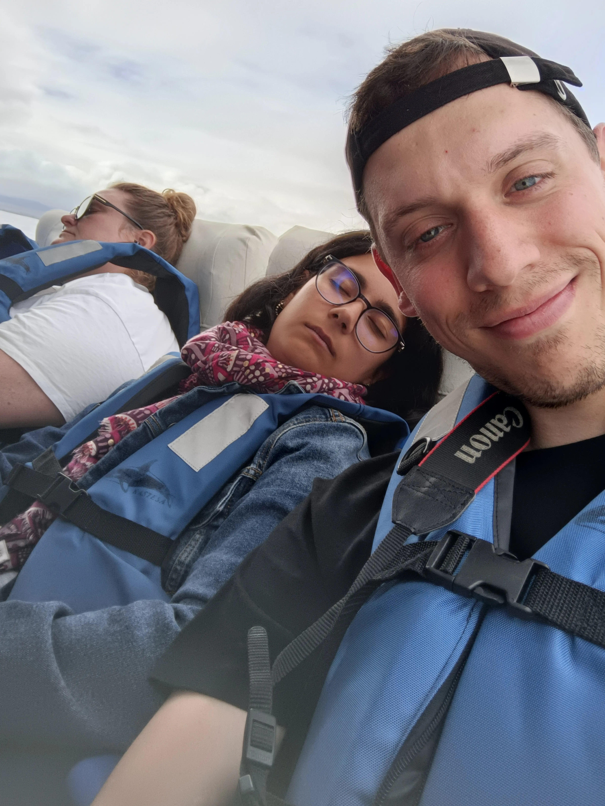
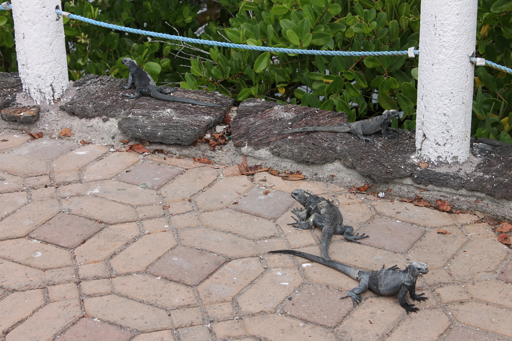

---
# Giorno 15 - Esodo parte dos
Ah, che splendida giornata oggi a Guayaquil.
La giornata odierna è all'insegna degli spostamenti.
## La Baltra, l'Isabela e la Santa Cruz
Ci spostiamo in aeroporto alle 7:30, e ci sediamo davanti alle piste. Abbiamo la fortuna di vedere un operatore che ci mostra come replicare la posa del famoso monumento a [Guayas e Quil](https://www.tripadvisor.es/Attraction_Review-g303845-d13129425-Reviews-Monumento_a_Guayas_y_Quil-Guayaquil_Guayas_Province.html) (che vediamo sullo sfondo):

Voliamo fino all'aeroporto di Baltra, una minuscola isoletta nell'arcipelago delle Galapagos:

Capiamo subito che in questi posti c'è un sacco di gente interessante; non sembra, ma questa foto è alquanto affollata:

Ecco un indizio per chi si fosse perso:

Vediamo anche alcuni volatili che sembrano dei [draghi](https://it.wikipedia.org/wiki/Fregata_magnificens):

E come ciliegina sulla torta, vediamo anche un pescatore locale che si riposa prima di andare al lavoro:

Appena ci vede decide di scendere dal gommone e salire sul pontile per salutarci:

Da Baltra ci spostiamo nella vicina Santa Cruz, e subito prendiamo un battello per Isla Isabela, alla quale arriviamo dopo 2 ore di scampagnata nel pacifico:

Ah, durante questo viaggio intermedio qualcuno ha deciso che si prendeva [una camomilla](https://www.my-personaltrainer.it/Foglietti-illustrativi/Xamamina.html). Si è risvegliata quando abbiamo attraccato.

Sono le 17:30.

Andiamo nel nostro ostello, ci sistemiamo, ceniamo, e pronti per dormire.

A domani, buonanotte (ore 20:36 locali).

## Bonus
Dopo una discussione dettagliata e approfondita, abbiamo pensato che questi lucertoloni devono per forza parlare romano.

*"Ao, o te levi dar sole o T’ADDOBBO COME ‘N ARBERO DE NATALE"*

#### Curiosità del giorno
Se il sole fosse un buco nero, sarebbe una sfera di 3 km di raggio. Il suo raggio attuale è di circa 700 000 km.
#### Fatto del giorno
Il romanzo più lungo mai scritto è “Alla ricerca del tempo perduto” di Marcel Proust, che conta quasi 1 milione di caratteri. Che voglia.

