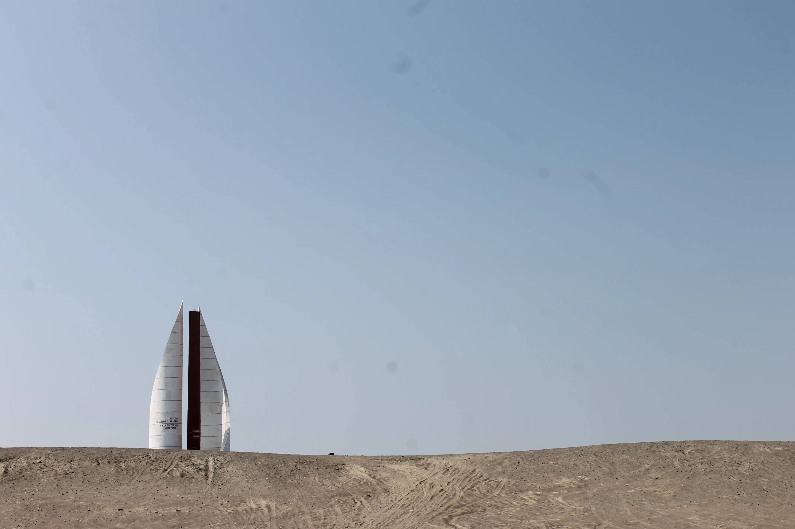

---
# Giorno 2 - Paracas

Secondo giorno, seconda onestissima sveglia, 4:23. 
Ridiamo il buongiorno (e un arrivederci) a Lima.

Abbiamo appuntamento alle 6:15 con Miguel, che ci accompagna alla stazione dei bus.
Ci imbarchiamo sul nostro bus alle 7:15.  
Il nostro bus è ENORME. Un bus di lusso. Talmente di lusso che Giovanni riesce ad allungare le gambe da seduto. Incredibile.  
"Sono in paradiso." [Giovanni]

## Paracaibo
Arrivati a Paracas, ci accoglie Valter, e dopo averci infilati in macchina, ci porta nel mezzo del deserto.  
In particolare, ci porta nella riserva naturale di Paracas, 3350 km², di cui 65% mare e 35% sabbia.

No, non avete una [miodesopsia](https://www.ospedaleniguarda.it/news/leggi/aiuto-vedo-le-mosche-volanti-sono-le-miodesopsie), qualcosa è finito dentro alla macchina fotografica, quindi questi puntini neri ci accompagneranno per tutte le foto di oggi :)

La struttura in foto è un monumento al generale San Martín (suona famigliare?) e i colori rimandano alla bandiera del Perù, che come da leggenda viene creata dopo che in una calda notte d'estate Martín sogna dei fenicotteri e decide che il rosso (i fenicotteri sono rosa, ma non fa nulla) e il bianco gli stanno particolarmente simpatici.

Ah, fyi [Paracas](https://es.wikipedia.org/wiki/Paracas) è un paesotto di 4000 persone, perlopiù pescatori. Pisco (di nuovo, suona famigliare?), poco lontano, ne conta circa 150000.

Ci addentriamo nella riserva:

## Fossili
Come prima cosa Valter ci porta a vedere delle conchiglie pietrificate; il deserto non è sempre stato deserto, una volta, circa 36 milioni di anni fa, era un fondale marino:

Un'altra cosa cosa straordinaria è la strada: per visitare i 40km di itinerario, i peruviani non hanno asfaltato un singolo centimetro di riserva, ma hanno sfruttato la presenza di un suolo molto ricco di sale, che permette ri ricavare delle vere e proprie strade in modo completamente naturale:

Tutto ciò è geniale. 
(La strada è nera a causa degli pneumatici delle auto).

## Buon Natale
La prossima tappa di chiama "Panetton" (per pronunciarlo in modo corretto bisogna pensare molto intensamente di essere veneti).

Alla sinistra del Panetton, il deserto incontra il pacifico:

## Playa Yumaque
Ecco la playa Schumacher (come la chiama l'Elisa):

Si, l'omino a destra è Valter.

La spiaggia è formata dalle conchiglie frantumate con il tempo, è bianchissima. Ecco alcuni degli inquilini:

Questo signore è un [ostrero](https://es.wikipedia.org/wiki/Haematopus_ostralegus), e gli piacciono i frutti di mare.  
In mezzo alle rocce invece, abbiamo visto qualcun altro fare cucù:

## Buen Provecho
Da sinistra: Elisa (28) e Giovanni (29), stanno per andare a pranzo.

Ceviche (si, di nuovo):

Un pesce di cui non ricordiamo il nome:

L'Inca Kola:

E' come bere un mix di caramella mou e cedrata Tassoni. Squisita.

## Al final del día
A domani, buonanotte (ore 20:05 locali).

## Bonus
A metà 800, il Perù fu uno dei maggiori produttori di guano del mondo.  
L'[era del guano](https://en.wikipedia.org/wiki/History_of_Peru_(1845%E2%80%931866)) fu una epoca di straordinaria ricchezza.

Il guano è quello bianco.

#### Curiosità del giorno
Il rivelatore ATLAS al CERN pesa circa 60 milioni di banane.
#### Fatto del giorno
Secondo alcune leggende, Boccaccio sarebbe stato un ladro di manoscritti, sottratti all'abbazia di Montecassino.
