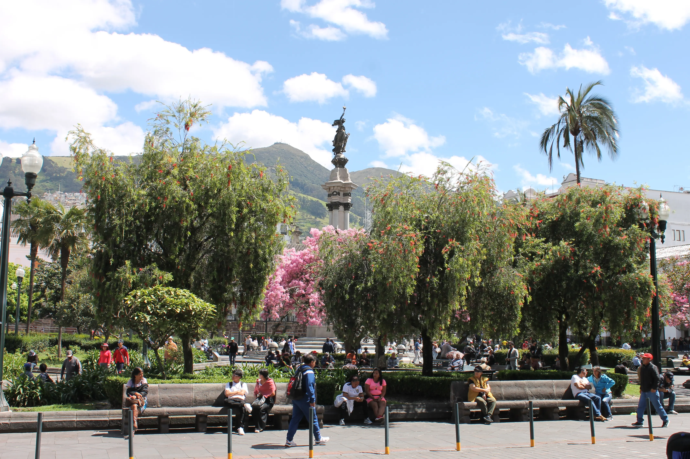
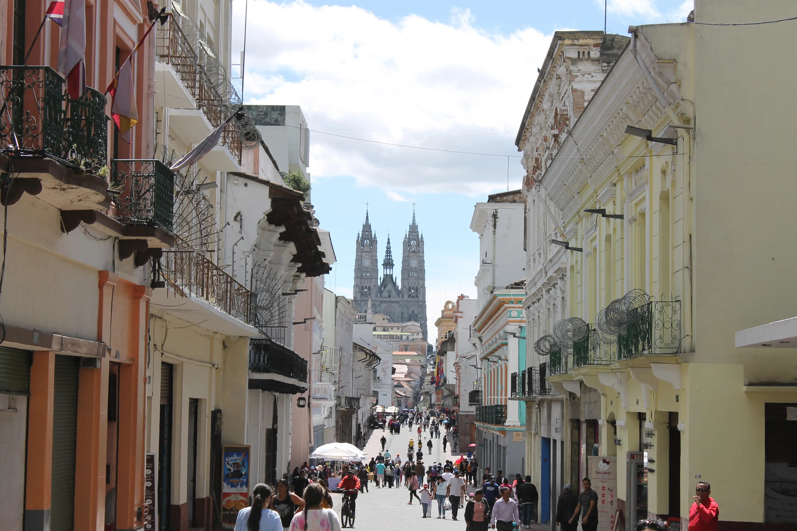
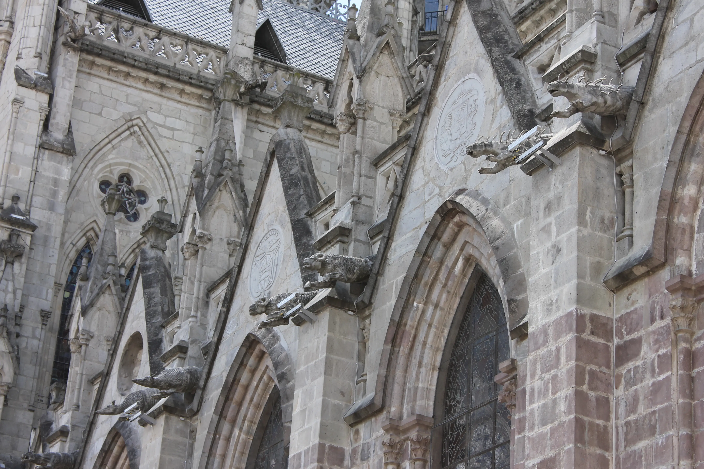
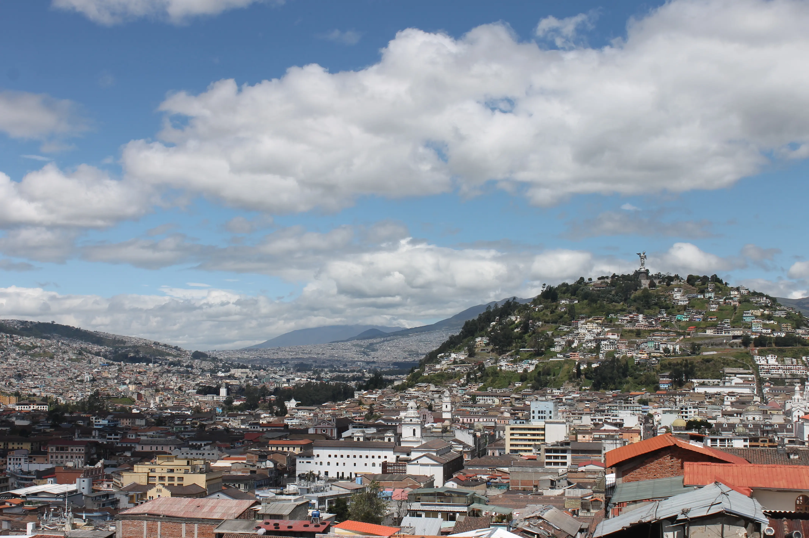
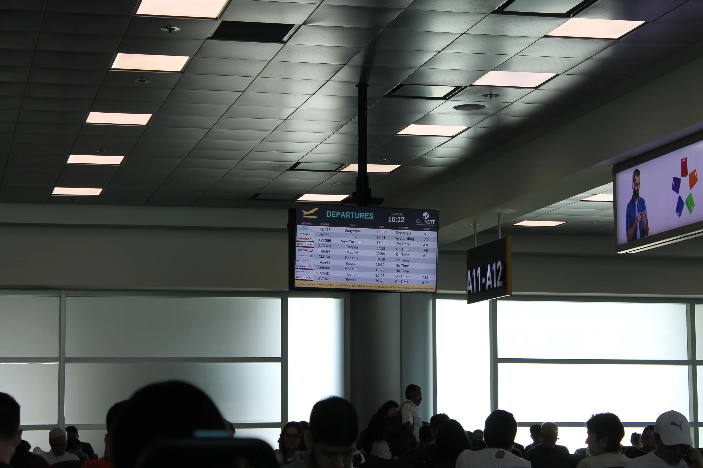
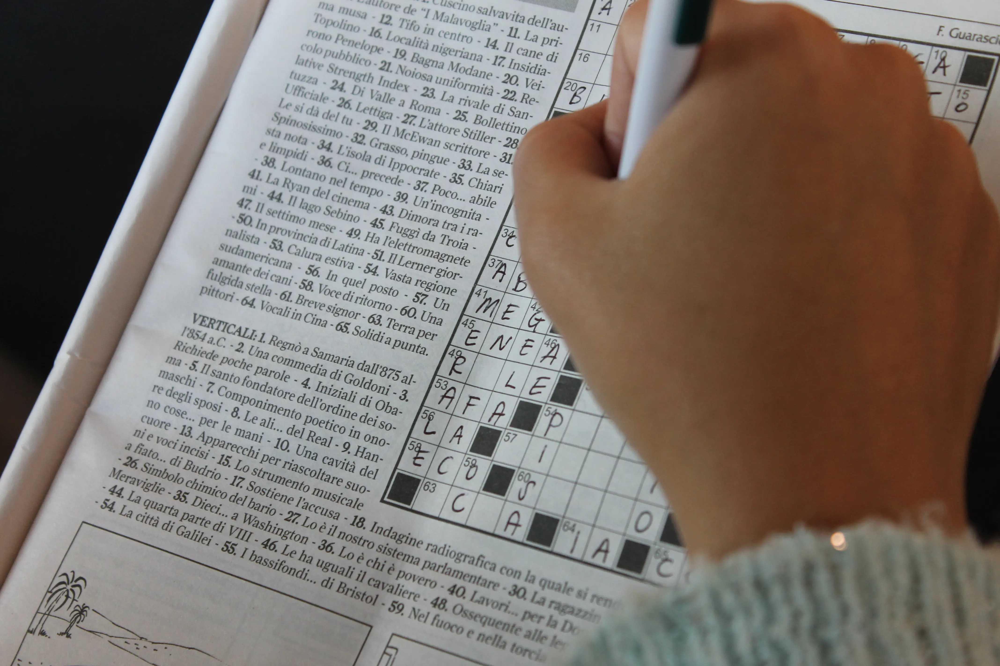

---
# Giorno 20 - That's all folks.

## La metà del mondo
Good morning Quito, capitale dell'Ecuador a metà del globo terrestre (0° 13' 47.46" N). 
Ah, un piccolo reminder sul fatto che questa città è sulle ande, a 2850 m s.l.m.

Stamattina facciamo una passeggiata nel centro, iniziando con Plaza Indipendencia.

Come singolo highlight della mattinata, vorremmo riportare la [Notre Dame Ecuadorena](https://es.wikipedia.org/wiki/Bas%C3%ADlica_del_Voto_Nacional):

Curiosità, al posto dei gargoyle qua hanno gli animali locali:

Si può anche salire sulla torre più alta, e noi ovviamente SALIAMO questi benedetti 83m di torre. Dalla cima vediamo Quito, che si sviluppa come un salsicciotto, integrandosi con le nostre amiche Ande:

A destra, in cima alla collina, si può anche vedere la [Virgen de El Panecillo](https://en.wikipedia.org/wiki/Virgin_of_El_Panecillo), una statuetta alta 41m.

Un'altra curiosità: Quito conta circa 17 vulcani attivi, sparsi qua e là. 
*Ma perchè la gente dovrebbe costruire una città in mezzo a tutti questi vulcani?* [Elisa]

Peccato essere rimasti cosi poco, ma abbiamo promesso che torneremo.

Ciao Ecuador, alla prossima.

## Hacia Madrid
Eccoci di nuovo in aeroporto.

Da qui arriviamo a Madrid, poi a Bologna, poi a Modena, poi di nuovo a Ginevra.

Grazie per essere stati i nostri compagni di viaggio.

Al prossimo diario, buonanotte (ore 17:22 locali).

## Momento nostalgico
Potremmo iniziare questo paragrafo con una lamentazione riferita alla fine della vacanza e al ritorno alla monotona, ripetitiva vita di tutti i giorni. 

Invece noi vorremmo ringraziare il Perù e L'Ecuador per alcuni regali che abbiamo ricevuto e che ci impegneremo a fare nostri:

#### Le tre regole
Le tre regole Quechua, by gli abitanti di Taquile:
1. *ama sua*: non rubare
2. *ama llulla*: non mentire
3. *ama qhilla*: non essere pigri

#### L'ospitalità fa la civiltà.
Abbiamo avuto l'immensa fortuna di stare in mezzo a gente autentica, che ce la mette tutta per trasmettere l'amore che ha verso la propria terra e verso i propri valori. Sono stati tutti straordinariamente gentili, puntuali, disponibili e professionali.

Grazie a Jesus, Valter, Victor, Jose, Fran, Luis, Pedro, Raul, Michael, Bob, Gaudi, Rrroy, Jhonny, Cecilio, Joel, Wilbert, Riccardo, Ada Luz, Marco, Alicia, Edison, Juan, Darwin, e tutti i viaggiatori con cui abbiamo condiviso questi giorni.

Grazie soprattutto a [Viaggi Solidali](https://www.viaggisolidali.it/) e [Perù Responsabile](https://www.peruresponsabile.it/), che non hanno sbagliato un colpo.
Non c'è stata destinazione in cui non ci fosse qualcuno pronto ad aiutarci, non c'è stato un singolo appuntamento mancato.

## Bonus
Non ci viene la 7 verticale, 10 lettere, crediamo inizi con EP. Grazie.

#### Curiosità del giorno
Durante un giro nella foresta qualche giorno fa, Giovanni ha sbattuto la testa contro un ramo andando ad una velocità di 2m/s. Se l'impatto è durato 0.1 s, quanto forte ha dato la capocciata in Newton? Supponiamo che il testone di Giovanni abbia una massa di 4kg circa. [Suggerimento da usare solo in caso di urgenza.](https://fisica.scienze.narkive.it/gTPTxHCz/forza-di-impatto)
#### Fatto del giorno
L'altra sera l'Elisa, in preda ad un raptus di rabbia causato da un turista tedesco che parlava ad alta voce alle 21:30, chiaramente dopo il coprifuoco, è uscita dalla camera e ha urlato "WHEN YOU GO TO BED CAN YOU TAKE OFF THE LIGHTS?". Gli esperti di inglese sapranno che "take off" significa decollare.

