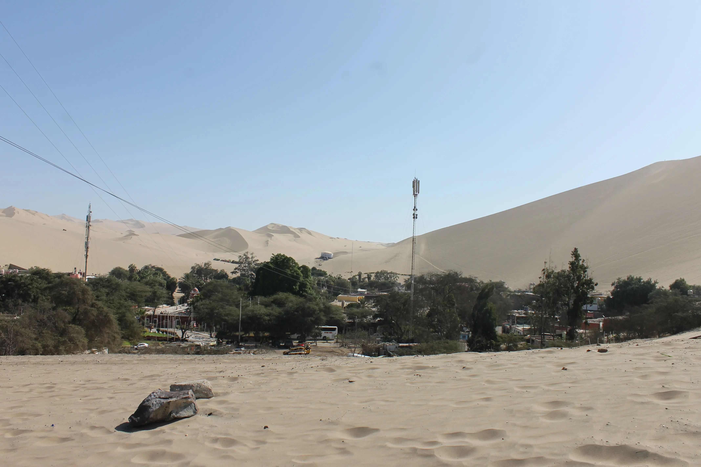

---
# Giorno 3 - Ica

Terzo giorno, sembra infinito, quindi preparatevi. 
Sveglia alle 6:30 per andare alle Islas Ballestas, aka le Galapagos in miniatura. 
Good morning Paracas:

Alle 7:45 siamo pronti per imbarcarci, e dopo appena una svolta a sinistra siamo davanti ad uno dei misteri irrisolti del Perù:

Il candelabro è l'unica "linea" che c'è a Paracas, tutte le altre sono a Nasca. Ci sono 3 ipotesi (non confermate e mutuamente esclusive) dietro alla origine del glifo:
1. San Martín e l'ordine dei Massoni; no, non è tratta da un romanzo di Dan Brown. Il Candelabro (simbolo massonico) potrebbe essere stata una idea del nostro eroe preferito.
2. Il Candelabro non è un candelabro, ma un cactus. E non un cactus qualunque, il [San Pedro](https://es.wikipedia.org/wiki/Echinopsis_pachanoi). Fra il 700 e il 200 a.C. questo cactus veniva utilizzato come "anestetizzante", e sembra fosse molto importante, quasi venerato dalla popolazione. 
3. Ramon Rochas e la Chiesa; questo prete potrebbe essere dietro all'origine del glifo, creato come simbolo cattolico.

C'è anche una quarta teoria, che ci sembra la più verosimile, cioè che il Candelabro sia opera degli alieni.

## Islas Ballestas
Il guano è l'indiscusso protagonista della visita, oltre che argomento preferito della nostra guida:

Tuttavia, durante ala visita, (fortunatamente) incontriamo anche altre situazioni interessanti, come ad esempio un corso di pesca subacquea:

I pinguini (li vedete? Sono a destra):

E infine, per la gioia immensa dell'Elisa, i cani del mare:

Se qualcuno non credesse alla veridicità dell'espression "gioia dell'Elisa":

## La tierra del sol eterno
Estremamente contenti (e leggermente infreddoliti) lasciamo Paracas per andare ad Ica, nella quale veniamo accolti dal sole (finalmente).

Il clima è completamente diverso da quello degli scorsi giorni, siamo nel deserto di Huacachina.  
Non abbiamo tempo di visitare la città perchè Victor, la nostra guida, ci accompagna subito nel bel mezzo del suddetto deserto, in una "bodega" che produce il famosissimo Pisco.  
Per quanto lo stato delle vigne sia dubbio:

La degustazione ci convince dell'ottima qualità del prodotto:

Ci fermiamo a pranzo e assaggiamo alcuni piatti della cucina locale, di cui sfortunatamente non ricordiamo i nomi, quindi li abbiamo inventati.  
Abbiamo il sandwich di purè con insalata di pollo:

E il kinder avocado sorpresa:

Questo tour, unito alla visita delle isole di stamattina, ci sembra sufficiente per ritenerci soddisfatti della giornata, ma Victor non ha finito con noi.

## L'oasi
Victor ha 41 anni, è il papà di Fabrizio (17) e Juanita (11), a fa (molto bene) l'operatore turistico. Sua moglie, Carina, fa l'infermiera nell'ospedale di Ica. 

Sembra che Victor ci abbia preso in simpatia, e dopo pranzo ci porta nella famosa [Oasi di Huacachina](https://it.wikipedia.org/wiki/Huacachina), 

e ci scarica nel giardinetto interno di alcune case, che è stato riconvertito ad ufficio turistico. Giovanni non può fare a meno di notare subito un dettaglio molto importante:

Il proprietario dell'ufficio turistico, Jose, ha una RTX 3060 e la usa per compilare delle fatture in PDF. Chi ha orecchi, intenda.

Jose ci dice che oggi faremo sand-boarding, e che faremo anche dune-buggying. L'Elisa ribattezza il tutto *sand-bagging*.

## Sand-bagging
Usciti dall'ufficio turistico, ci guardiamo intorno:

Bello il deserto.

Mentre aspettiamo di fare sand-bagging, facciamo due passi per l'oasi, e intuiamo subito il mood generale:

Decidiamo di fare anche qualche foto artistica:

E dopo poco sono le 15:45, l'ora del nostro randez-vous.

Bello il deeserto:

Ci fanno sedere (noi, e altri 5 ragazzi) dentro questa:

Durante le seguenti 2 ore abbiamo scorrazzato nel deserto ad una velocità media di 70 Km/h, saltando fra le dune come le [Hot-Wheels](https://www.youtube.com/watch?v=ypAthG-mMoQ).
Questa è l'unica foto dritta che siamo riusciti a fare in corsa:

Ci siamo (per fortuna) anche fermati a dare una occhiata al deserto:

Questo è Fran, quel pazzoide del nostro autista:

Aspettando il tramonto, abbiamo assistito ad una scena indimenticabile:

Abbiamo chiesto a Fabien, un tizio francese, di farci una foto:

E finalmente abbiamo visto un tramonto sul deserto:

## Per Nasca?
Alle 19:00 saliamo sul bus per Nasca, arriviamo in hotel alle 22.  
Per riassumere la giornata ci viene in mente soltanto "bestia, che botta". 
A domani, buonanotte (ore 22:27 locali).

## Bonus
L'Elisa è contenta di questa giornata:

#### Curiosità del giorno
Le leggi della fisica non sono sempre le stesse se invertiamo la destra con la sinistra.
#### Fatto del giorno
Durante il suo esilio londinese, Foscolo era seduto a leggere un libro nel suo studio, quando irruppe un suo rivale in amore e prese a sculacciarlo con un frustino.

