---
# Giorno 4 - Nasca

Il giorno numero 4 comincia con una [scossa di adrenalina di magnitudo 7](https://earthquake.usgs.gov/earthquakes/eventpage/pt24180000/executive) (ore 00:36 locali).

Dopo esserci assicurati che il palazzo non fosse crollato siamo, come da manuale, andati in strada per attendere eventuali scosse di assestamento.

Abbiamo notato che gli indigeni non erano molto scossi dalla situazione, anzi.   
Questo ci ha rassicurato, e dopo poco, siamo ritornati in camera per provare a dormire almeno qualche ora. 

(Ri)Svegliati alle 7:00, ci prepariamo per incontrare Luis, che alle 8:30 ci accompagna attraverso Nasca, nel deserto.
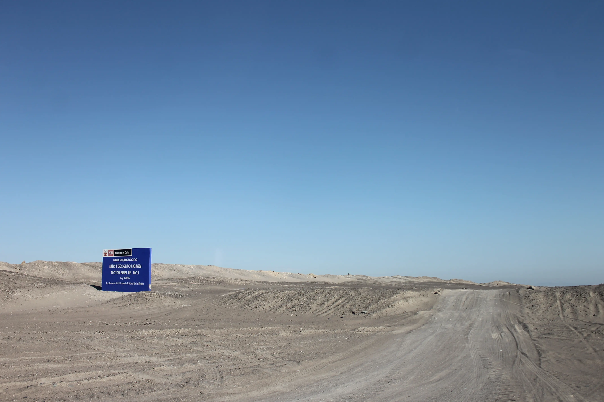
Il deserto di Nasca è diverso da quello di ieri, è roccioso. Sembra un po di essere sulla luna.

## Cahuachi
Nel mezzo del deserto, c'è il letto di un fiume, che si riempie in febbraio, quando la pioggia che cade sulle ande arriva nella valle di Nasca. Attorno al letto del fiume, c'è un'oasi:
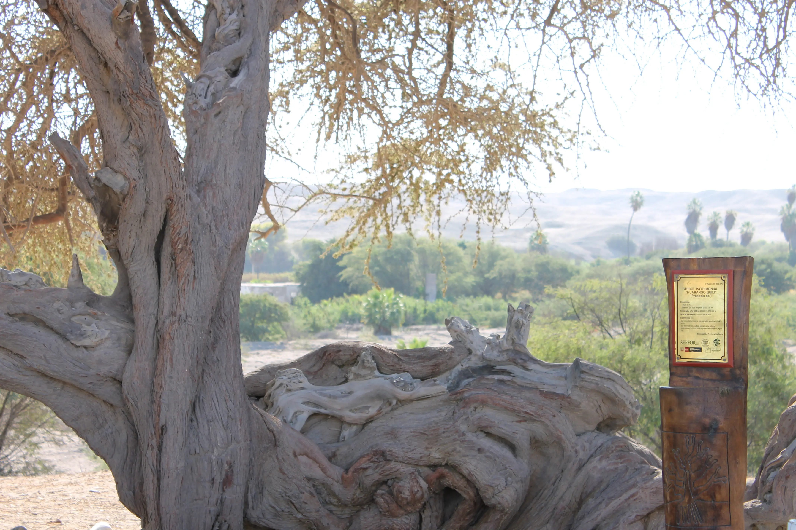
Questo albero tutto attorcigliato ha più di 1000 anni.

Vicino a questa oasi, c'è [Cahuachi](https://it.wikipedia.org/wiki/Cahuachi).  
Cahuachi è (fu) un centro cerimoniale scoperto dal [Consiglio Nazionale delle Ricerche](https://it.wikipedia.org/wiki/Consiglio_Nazionale_delle_Ricerche) nel 2008. Si, scoperto da italiani :)
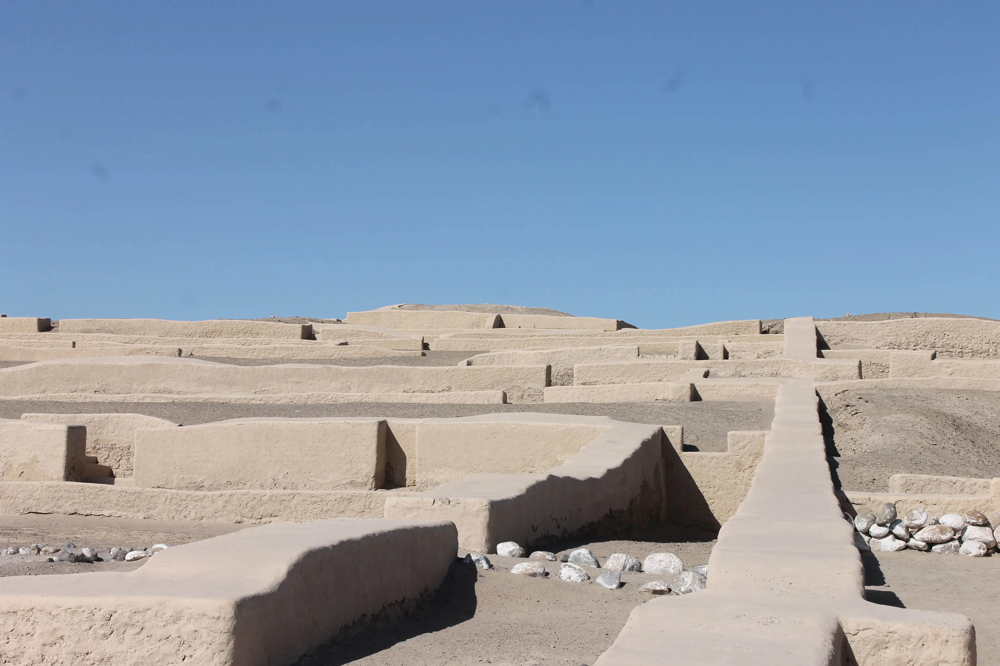

Luis ci ha sommerso di informazioni, ma noi vorremmo proporvi una selezione:
1. La gente non viveva li, ci andava solo in "pellegrinaggio".
2. Il pellegrino era sottoposto a prove fisiche e mentali durante il pellegrinaggio.
3. Venivano selezionati alcuni prescelti che cercavano di convincere gli dei della pioggia a sponsorizzare anche per quell'anno il raccolto. La [modalità di convincimento](https://www.peruparadisetravel.com/sacrifici-umani/) la lasciamo agli interessati.

Qui sotto potete vedere Elisa che si informa meglio sulle sue origini inca, mentre torniamo alla macchina. 
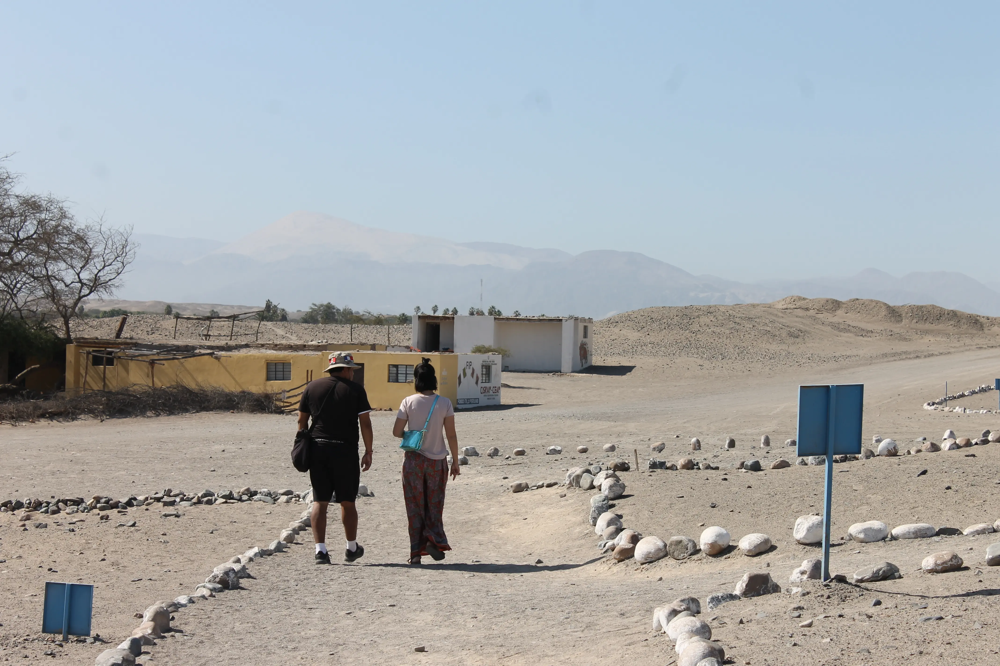
Sullo sfondo, in lontananza, potete anche notare il Cerro Blanco, la più grande duna di sabbia del mondo, con una altezza di 2078m.

## Dai con ste linee
Usciti dalla strada sterrata, imbocchiamo uno [stradone](https://it.wikipedia.org/wiki/Panamericana) che ci porta nel bel mezzo del nulla:
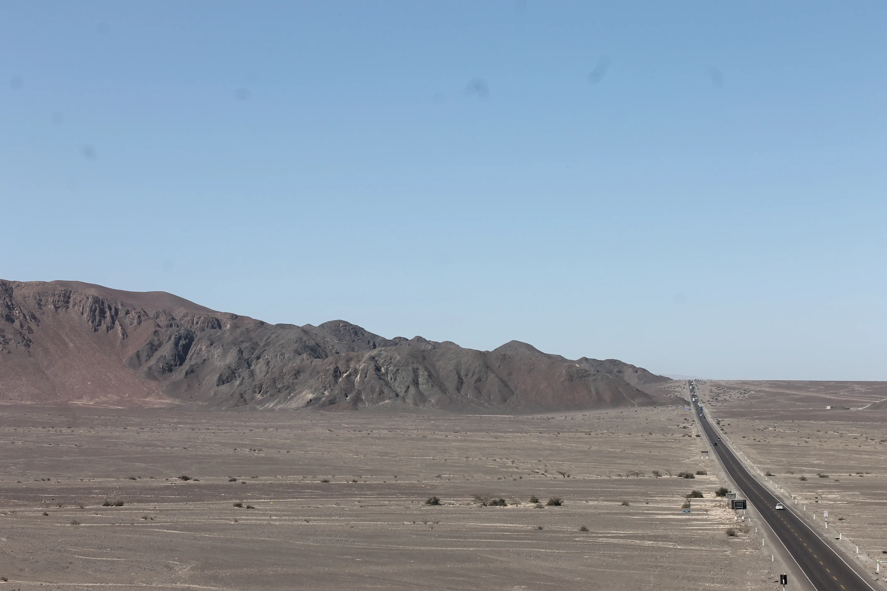
Qui cominciamo a notare degli strani solchi per terra:
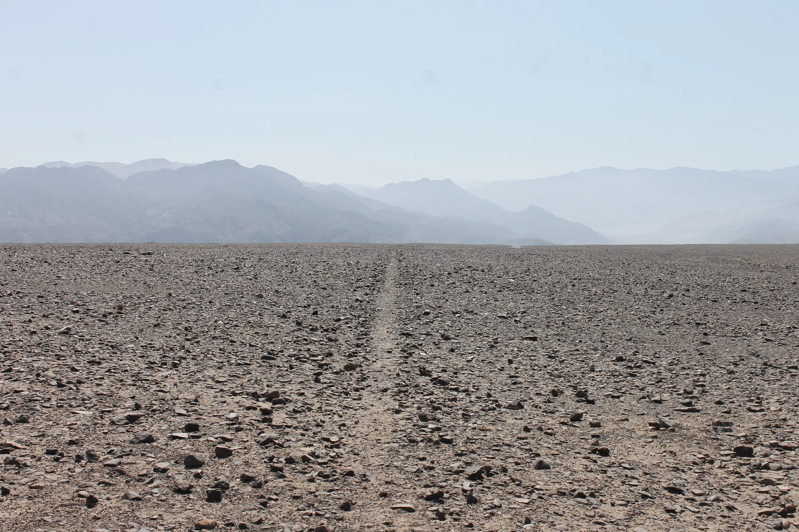
No, sulo sfondo non ci sono i cancelli di Mordor. 
Ci avvaliamo di una comoda torretta li di fianco per indagare meglio, e scopriamo che i solchi non sono fatti per caso, ma se guardatio dall'alto, compongono dei disegni!
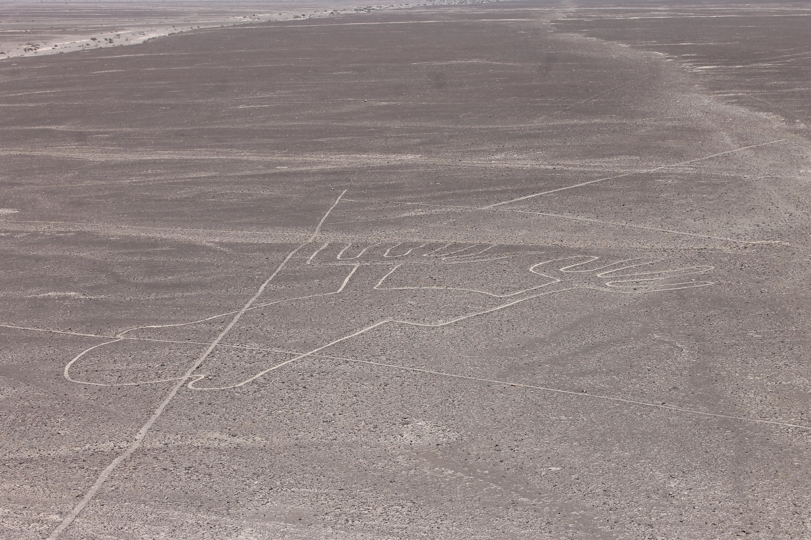

Luis ci racconta che questi [geoglifi](https://it.wikipedia.org/wiki/Linee_di_Nazca) sono stati creati con la tecnica del bassorilievo, cioè togliendo le pietre contenenti ossidi di ferro dalla superficie del deserto, lasciando così un contrasto con il pietrisco sottostante, più chiaro (spudoratamente copiato da wikipedia).

Questi disegni hanno più di 2000 anni. 
Eccitati dal mistero che avvolge i geoglifi, facciamo il gravissimo errore di salire su questo:
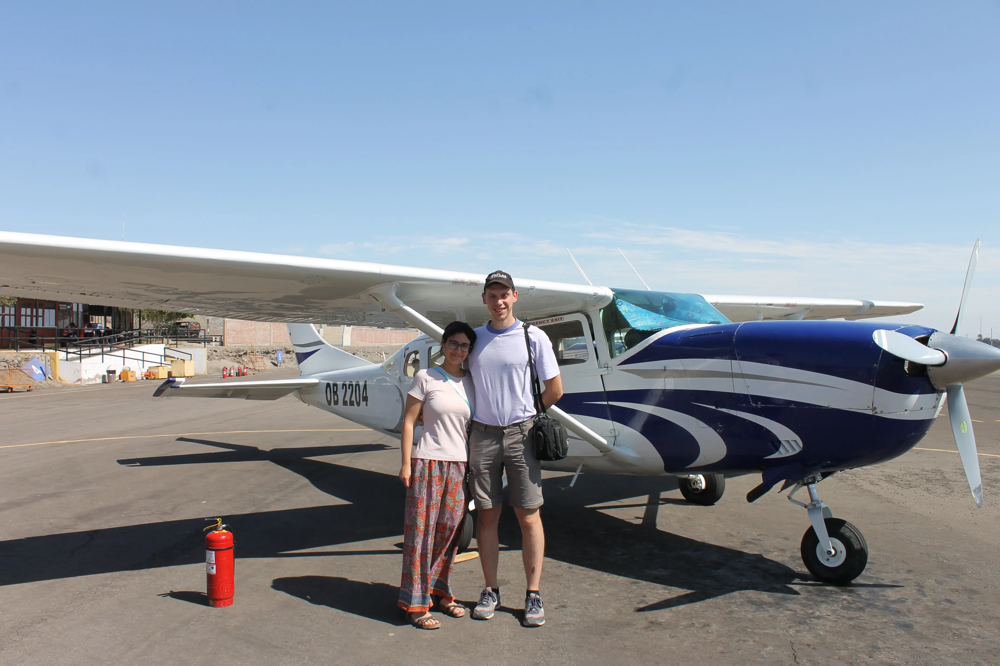
Assieme a noi ci sono altre 4 persone. L'Elisa si mette all'inizio della coda (lei odia le code) perchè vuole stare davanti, ma il capitano assegna i posti in funzione del peso, e Giovanni finisce primo.

Ci alziamo in volo e cominciamo un delizioso tour di 35 minuti sulla landa, avvistando vari disegni, come la scimmia:
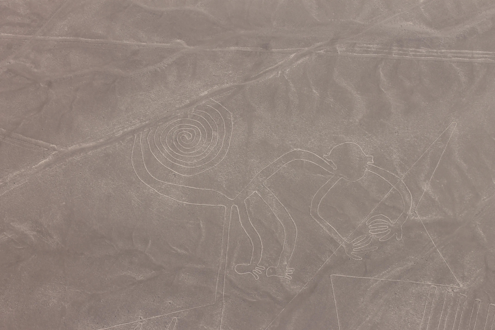
Un condor:
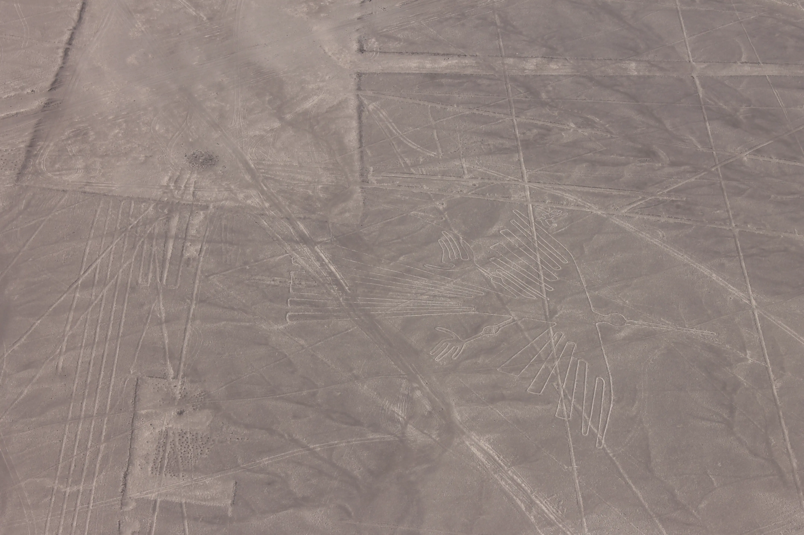
E il famosissimo ragno:
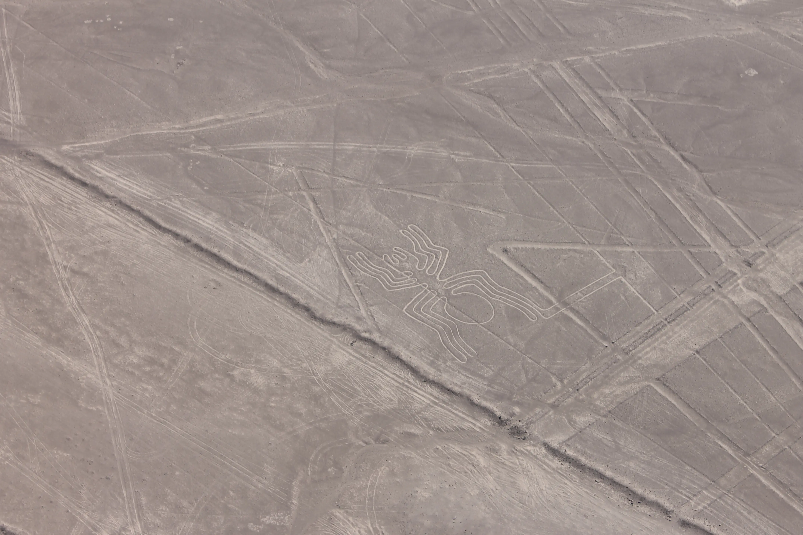

Tutto molto bello, se non fosse che tutti e 4 i nostri compagni di viaggio decidono di fare uso dei sacchettini che di solito sono riposti davanti ad ogni sedile. Tutti tranne noi.

Vabbè, ne è valsa la pena.

Notare come quei debosciati capitalisti che hanno costruito la Panamericana abbiano tagliato di netto la coda alla lucertola:
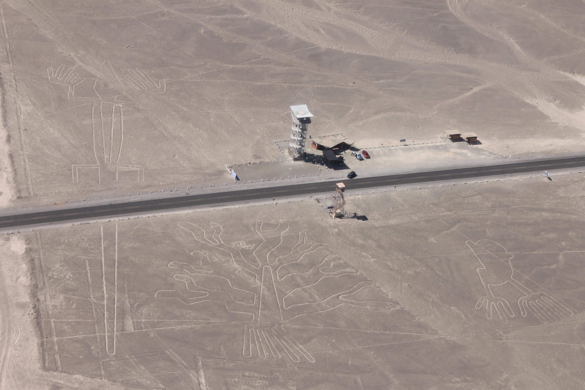
**FREDDURA ALERT**: Poco male, tanto ricresce.

## Qualcuno ha ordinato 3kg di patatine?
Luis ci rimette in macchina, e ci dice che a pranzo mangiamo in un posto da camionisti.  
Oggi si mangia pollo alla brace. 
Pur avendo preso la versione ridotta per deboli di cuore "1/2 pollo", abbiamo faticato ad arrivarci in fondo. Il tutto per 10 euro in due. Straordinario.

## Musei, tappeti e ocarine
Dopo pranzo, facciamo una visita al Museo Arqueológico Antonini, dedicato alla cultura Nazca. Anche qui veniamo inondati dalle informazioni, dunque ci teniamo a riassumere i punti salienti;
1. Anche oggi abbiamo trovato il mood della giornata:
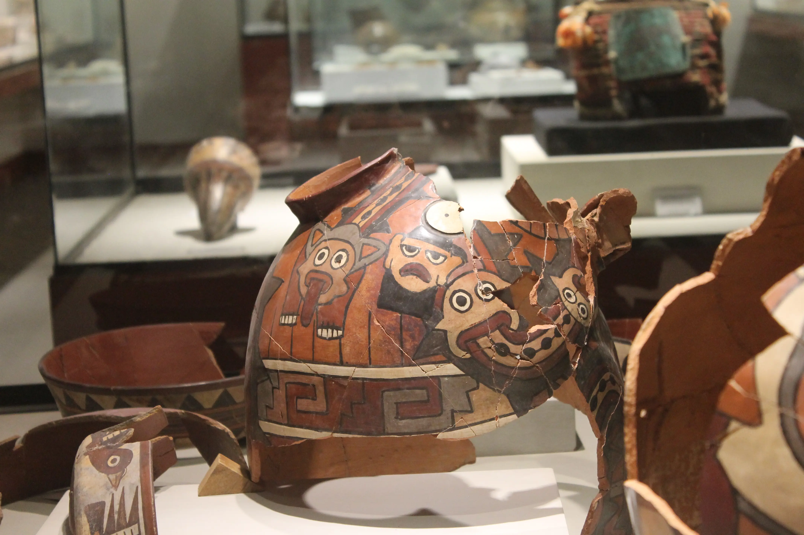
2. Questo è decisamente un ritratto dell'Elisa:
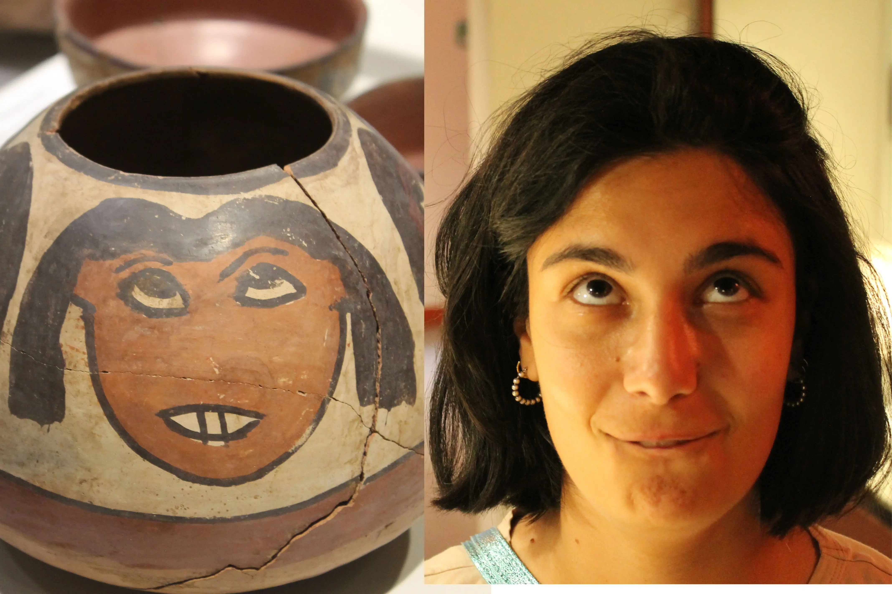

Subito dopo abbiamo visitato una fabbrica tessile, e infine il signor Pedro ci ha fatto vedere come la popolazione Nazca faceva le ceramiche.

Per cena ci siamo ingolfati di riso in un ristorante cinese per la modica cifra di 8 euro in due.
 

## Buenas noches?
Alle 22:00 saliamo sul bus per Arequipa.  
A domani, buonanotte (ore 22:27 locali).

## Bonus
Il capitano ha deciso di farci una foto durante il volo:
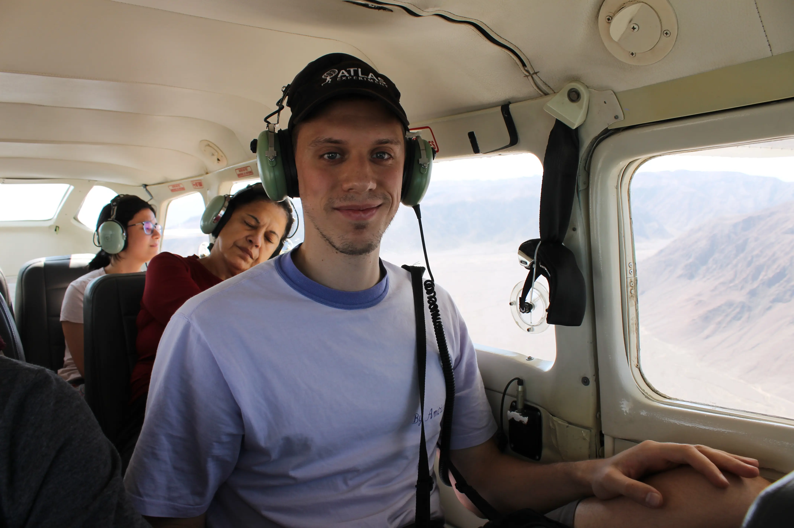
La signora sembra stare da dio.

#### Curiosità del giorno
Un fotone creato nel nucleo del sole, impiega 100 000 anni ad arrivare alla sua superficie, ma solo 8 minuti a raggiungere la terra.
#### Fatto del giorno
In vacanza a Capri Moravia andava in giro con un gufo su una spalla, mentre la Morante con un siamese al guinzaglio.

