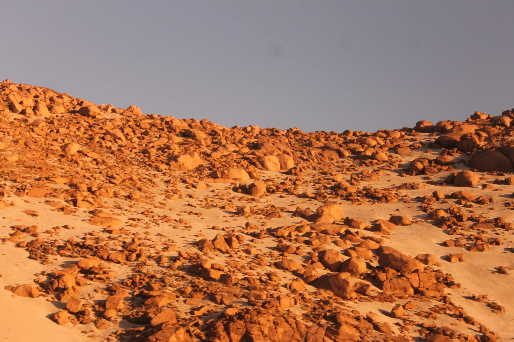

---
# Giorno 5 - Arequipa
Ci siamo resi conto che gli autisti dei bus in Perù sono convinti di guidare una Fiat Panda.  
Dopo una nottata sorprendentemente comoda per essere in bus, veniamo accolti dalle prime luci delle 5:45:

Anche oggi il paesaggio è cambiato. Se ieri eravamo sulla Luna, oggi siamo su Marte:

Arrivati in stazione alle 7:24, ci prepariamo ed andiamo nel nostro hotel. Oggi è una giornata libera, quindi decidiamo di prenderla con calma perchè sennò non arriviamo in fondo alla prima settimana.

Durante il trasferimento chiediamo all'autista se il terremoto di ieri fosse stato molto forte; l'epicentro era parecchio vicino ad Arequipa. Lui risponde "no lo noté" ("manco l'ho sentito").  
Che pivelli che siamo a uscire dalla camera per un misero 7.2.

Dopo la colazione, facciamo un giro in città. Vediamo le Ande per la prima volta:

Noi abbiamo le Alpi è vero, ma vedere la [Cordigliera delle Ande](https://it.wikipedia.org/wiki/Ande) ci fa pensare a qualcosa di primordiale, antico. La spina dorsale delle Americhe.

Come abbiamo già menzionato, oggi è un giorno in cui stiamo [nel chilling](https://slengo.it/define/chilling), quindi come prima cosa andiamo nella Plaza de Armas di Arequipa, in cui ammiriamo la Catedral:

Da li, prendiamo Avenida Moràl e facciamo un salto alla chiesa della Compagnia, e ai suoi chiostri.

## Juanita
Non possiamo poi non passare a vedere [Juanita](https://it.wikipedia.org/wiki/Mummia_Juanita), una delle mummie inca, vissuta 500 anni fa.  
Purtroppo nel museo era vietato fare foto, quindi lasciamo i dettagli agli interessati.

## Santa Catalina
Come ultima parte della mattinata, andiamo al [Monastero di Santa Catalina](https://en.wikipedia.org/wiki/Monastery_of_Santa_Catalina_de_Siena,_Arequipa); veniamo immediatamente sopresi da alcuni signori seduti ad un tavolo (spoiler, sono manichini):

Giuriamo che sul momento sembravano veri.

Il monastero è una cittadina dentro la città, incantevole:

Ci colpiscono i colori:

"Qui sono in palette" [Elisa]

Ecco un altro dei vicoletti:

Ci prendiamo un momento per ringraziare lo sponsor di oggi, la Inca Kola:

L'Elisa gioca a fare cucù:

Questa è l'ultima, promesso:

No, scherzavamo, questa è l'ultima:

Bombastic side eye.

## Day is over
Siccome ce lo hanno consigliato tutti, abbiamo provato [ZigZag](https://zigzagrestaurant.com/en/zig-zag-en/). 
Mooolto turistico. Molto Buono.  
Domani ci sarà da ridere, quindi andiamo a letto presto. 
Ci vediamo, buonanotte (ore 21:00 locali).

## Bonus
A Santa Catalina abbiamo trovato la secchia rapita

#### Curiosità del giorno
Nessuno saprà mai se quello che io intendo come rosso corrisponde a quello che tu intendi come rosso. Pensaci.
#### Fatto del giorno
Manzoni soffriva di agorafobia, era terrorizzato all'idea di camminare in strada da solo ed era ossessionato dal cinguettio degli uccelli.

