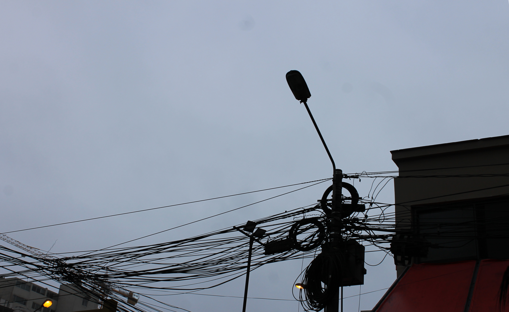
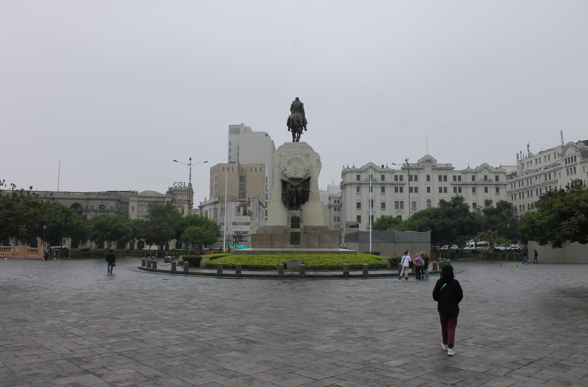
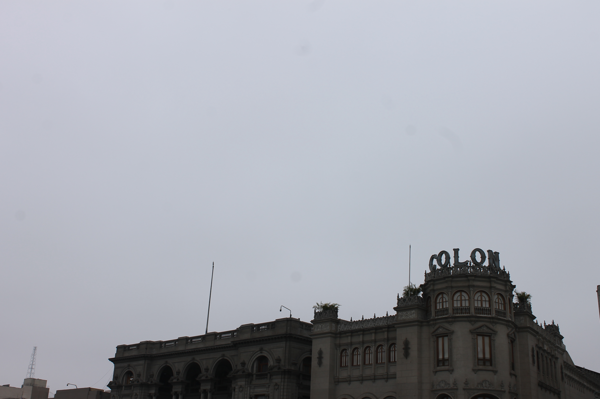
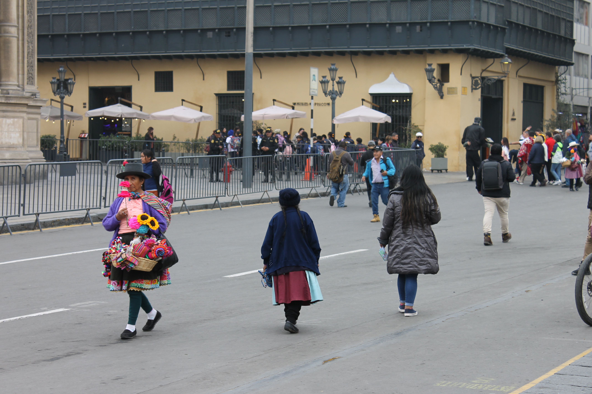
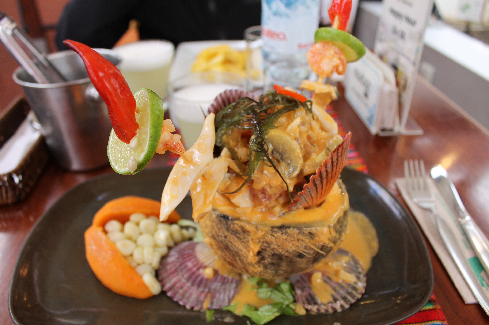

---
# Giorno 1 - Lima

Poco dopo essere arrivati in hotel, abbiamo deciso di fare una breve passeggiata. Non c'era nessun dubbio sul fatto che nei 5 minuti successivi avremmo trovato l'oasi per gatti piu' grande del sud America:

Si, ogni scatolone era una cuccia. Gatti ovunque. Tutto straordinariamente pulito.  
"Sono in paradiso." [Elisa]

## Briefing con Jesus
Dopo l'abbondante colazione che ci è sembrata un pranzo (forse perchè in italia erano le 13), abbiamo incontrato Jesus, che ci ha spiegato per filo e per segno tutto quello che faremo nei prossimi giorni.  
Giovanni non ha ascoltato molto, speriamo che l'Elisa sia sul pezzo.

Lasciato il [Tambo DOS](https://g.co/kgs/FwwYCMF), ci siamo diretti verso Plaza San Martín. 
Per chi amasse il cable management, ecco una delle numerose opere d'arte disseminate per la città:

## San Martino Campanaro
Il tassista ci ha preso in simpatia, e nella mezz'ora che abbiamo impiegato a fare la [tratta fino alla piazza](https://maps.app.goo.gl/At51bjQwZNvLfMge8) ci ha raccontato della statua del leggendario José de San Martín, protettore del Perù, considerato insieme a Simón Bolívar tra gli artefici più importanti della fine della colonizzazione spagnola in America Latina.

A proposito di Bolívar, pare che nell'Hotel Bolívar in piazza servano il famosissimo 
**Pisco sour** (come Piscopo, ma senza po).

Ci ha inoltre raccomandato un ottimo ristorante (te lo credo, è di suo fratello), di cui trovate [qui](https://maps.app.goo.gl/hFgsz3YfsiTL5TnG8) la location.  
Magari la proviamo quando saremo nei dintorni di Nazca.

Ah, c'è un'ultima cosa da vedere nella piazza, e sembra sia un teatro:

Nome incredibile.

## Un po di colore
Fino ad ora sembra che la palette di colori disponibili in Perù sia limitata al [Pantone 400-450](https://www.pantone-colours.com/).  
Aggiungendo le persone alle foto, si ottiene un chiaro miglioramento.  
Migrando da Plaza San Martín alla [Plaza Mayor de Lima](https://maps.app.goo.gl/n1qRzbM6Uhpic4V8A), abbiamo finalmente visto un po' di movimento (notare gli influenzer veri in foto): 

E ancora, una dolcissima signora alta 85cm, assieme ad una simpaticissima fioraia locale:

Immediatamente affianco alla piazza, abbiamo la "Casa della Literatura Peruana", dove l'Elisa ha finalmente ritrovato le sue origini perdute.

Ci sono innumerevoli altri punti di interesse nei dintorni della piazza, ma noi siamo stati subito dirottati verso il ristorante [La Muralla](https://maps.app.goo.gl/KhjnTNFNvU4pg3Jw6) da un curioso signore che abbiamo incontrato per caso mentre visitavamo la biblioteca della [Cattedrale di Lima](https://maps.app.goo.gl/1r2NNNqccn5Huy2t7).  
Ci ha assicurato che il Ceviche lo fanno molto bene. Aveva ragione:

Come ultima tappa, abbiamo optato per un salto al [Mercado Central](https://g.co/kgs/s4t1ayX); arrivati li, oltre al mercato, ci siamo trovati davanti questo:

Esattamente, una roba tipo China Town. Ci siamo subito ricordati di un'altro particolare di cui ci aveva parlato il taxista (al quale non abbiamo chiesto il nome 😔): la cucina [Chifa](https://es.wikipedia.org/wiki/Gastronom%C3%ADa_chifa), che sembra essere la fusione perfetta fra la gastronomia peruviana e quella cinese. [The best of both worlds](https://www.youtube.com/watch?v=uVjRe8QXFHY).

## Finalmente check-in
Dopo poco tempo abbiamo deciso che la privazione del sonno, l'affacendarsi frenetico delle persone al mercato, e l'incombente inizio del match Perù-Canada erano tutte buone motivazioni per togliersi dalla strada e dal traffico. 

A domani, buonanotte (ore 16:05 locali).

## Bonus
Scorcio trovato per caso in una stradina del mercato:

#### Curiosità del giorno
Se i GPS non includessero la relatività generale nei calcoli, la stima della posizione sarebbe sbagliata di una cinquantina di metri.
#### Fatto del giorno
Napoleone non era affatto un nanerottolo, anzi, misurava ben 3cm in più dell'Elisa Cottafava.
