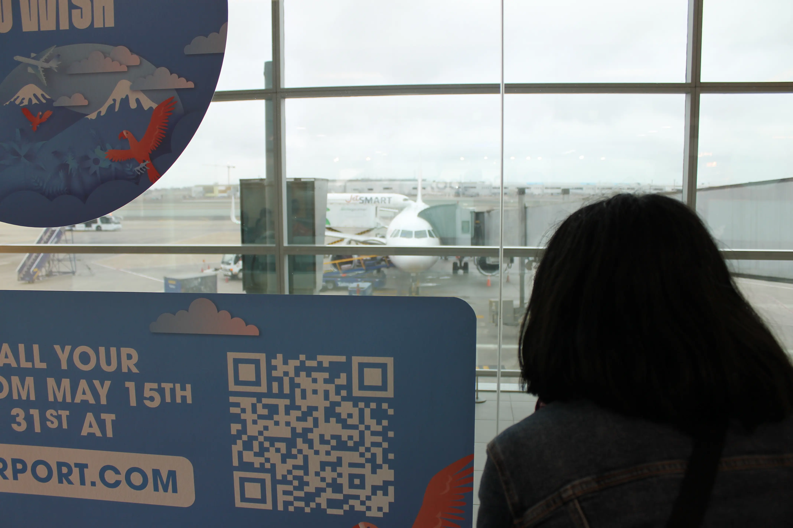

---
# Giorno 14 - Guayaquil
## Addio, addio, amici addio
Ah s**t, here we go again.

Oggi diciamo "[hasta la vista baby](https://www.youtube.com/watch?v=LRxaXmXvjnU)" al Perù.  
Ci vediamo, e grazie per queste due settimane strordinarie.

In aeroporto veniamo accolti da questa grandiosa vista:

🥲

E mentre aspettiamo di imbarcarci, l'Elisa controlla che i nostri zaini vengano caricati.

Spoiler, sono stati caricati.

## Equador
Atterriamo a Guayaquil e andiamo in albergo. 

Il resto della giornata lo passiamo a riposare, come i veri influenzer. Guayachisimuovedalletto.

A domani, buonanotte (ore 16:37 locali).

## Bonus
Nel parco di fronte al nostro albergo ci sono cani molto strani, qualcuno sa che razza sono?

#### Curiosità del giorno
Il 28 Giugno 2009, Stephen Hawking ha organizzato una festa a Cambridge per tutti i viaggiatori del tempo. Dopo la fine della festa, che ha passato in solitudine, ha spedito gli inviti.
#### Fatto del giorno
\"Frankenstein\" nacque per caso durante una vacanza tra amici scrittori che si sfidarono a comporre storie dell'orrore; a scriverlo fu la giovanissima Mary Shelley di appena 18 anni.

