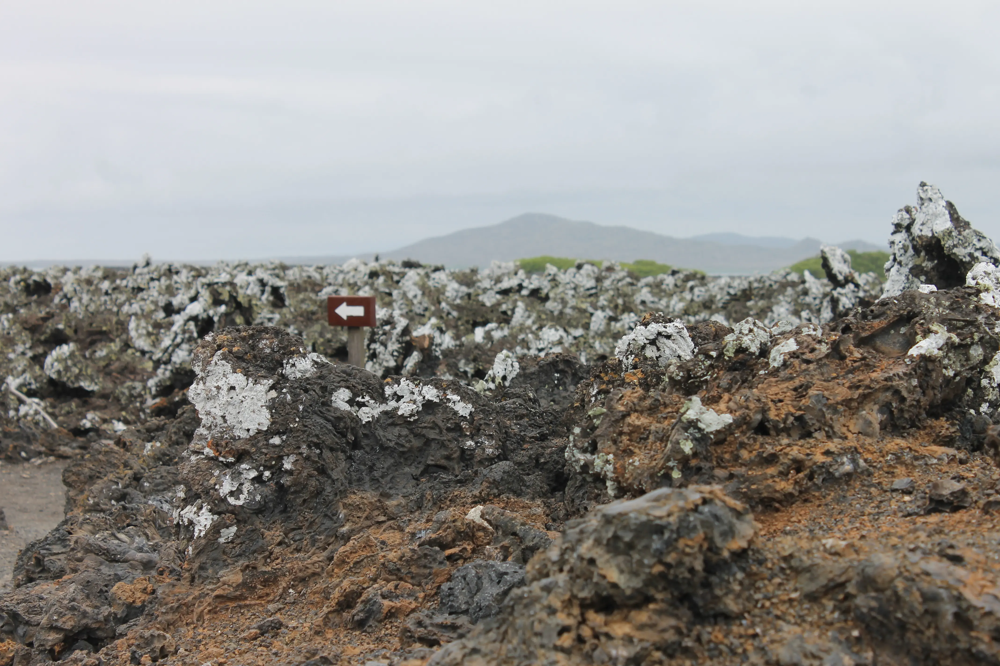
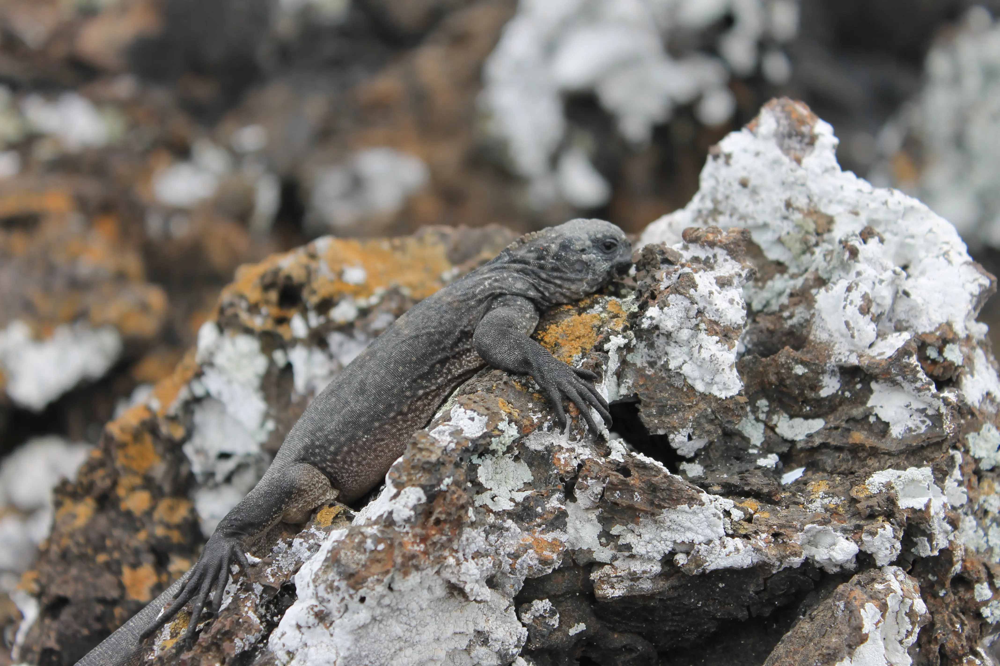
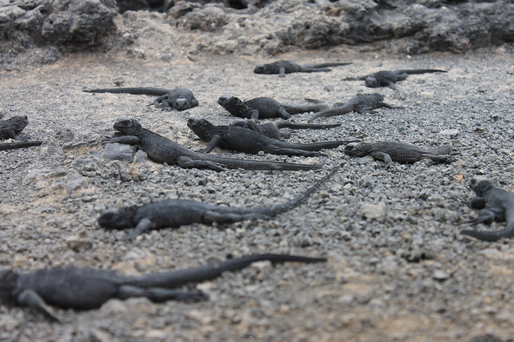
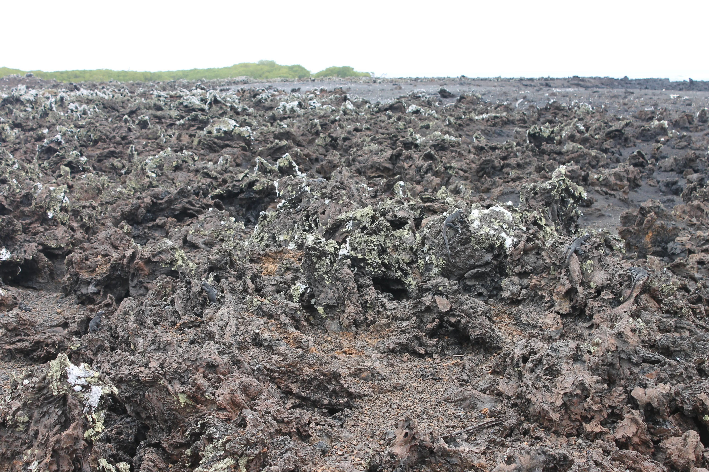
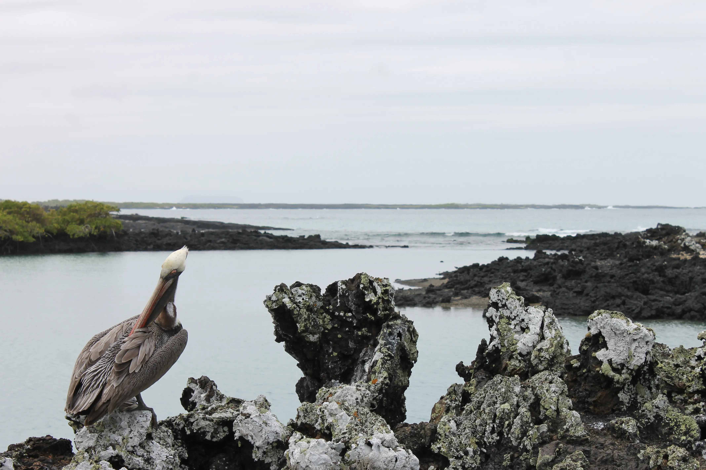
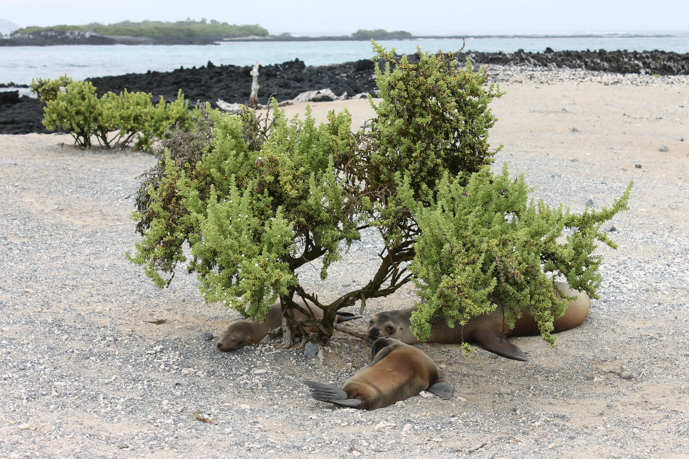
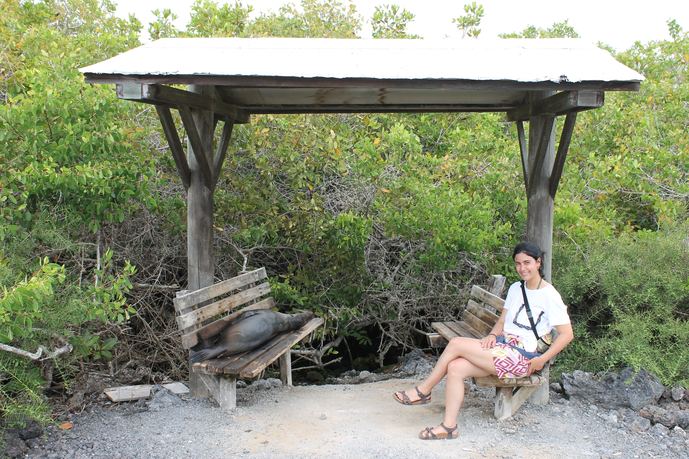
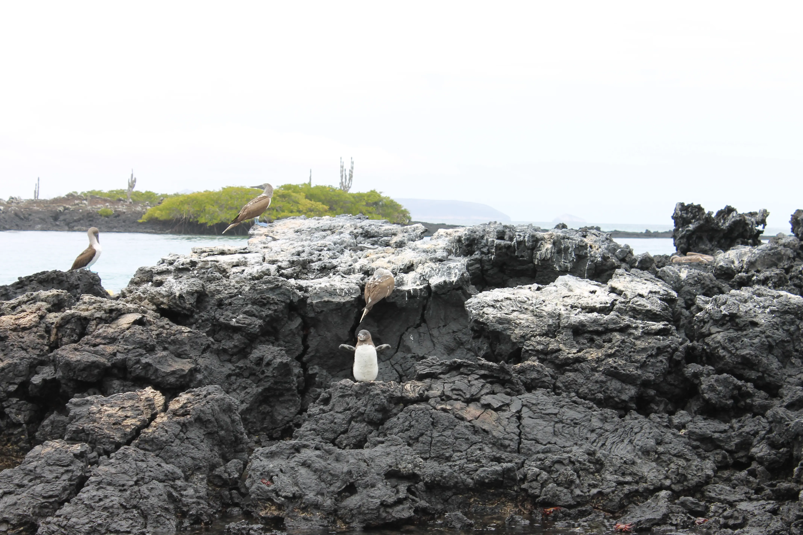
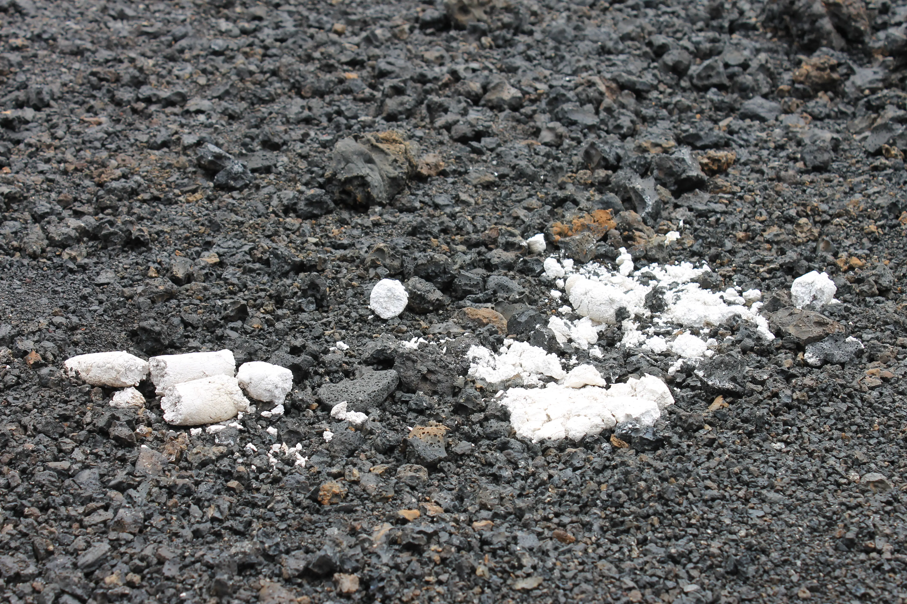

---
# Giorno 17 - Tintoreras
Anche oggi into the wild, con [las tintoreras](https://es.wikipedia.org/wiki/Islote_Las_Tintoreras).
Oggi è un giorno speciale perchè la giornata inizia alle 9:40. 

Ci imbarchiamo con un gruppo di ragazzi degli US, che partecipano ad un [progetto ecologico](https://www.ecologyproject.org/galapagos-impacts) assieme ad un loro professore e ad un esperto dell'università di Quito.

Dopo 10 minuti raggiungiamo una serie di isolette quasi attaccate ad Isabela, in cui speriamo di vedere 2 cose: iguane e pinguini.

Arriviamo sugli isolotti, che si presentano così:

Se avete letto l'episodio 3, potreste pensare che la coltre bianca sia il famosissimo e preziosissimo guano; no, sono licheni. Ecco una foto più da vicino:

Se controllate attentamente, oltre ai licheni potreste anche vedere una iguana che prende il sole; queste isole sono particolarmente amate dai rettili. Perchè? Beh, le Galapagos sono di origine vulcanica, e come è noto, la lava è particolarmente refrattaria. 

Le iguane, che sono bestioline dal sangue freddo, non vedono l'ora di avere qualcosa di caldo che le scalda da sopra come il sole, e qualcosa di caldo che le scalda da sotto, come la roccia vulcanica.

Per questo, ovunque andiamo vediamo iguane spiaggiate, proprio come i modenensi nei bagni di Riccione:

E non stanno solo sul sentiero, ma dappertutto in questo paesaggio un po' lunare; bisogna solo osservare molto attentamente:

Notato nulla?

Ora, se sapeste che a pochi metri da casa vostra c'è un ristorante all you can eat della vostra pietanza preferita, non decidereste di farci un salto spesso? Questo signore, che abbiamo chiamato Amilcare, va ghiotto di iguane e la pensa come voi:

Ovviamente i pellicani non sono gli unici intenditori di rettilame arrosto, ci sono anche loro:

Fra una siesta e l'altra non gli dispiace uno snack.
Siete liberi di non crederci, ma a noi tutto questo lo ha raccontato questo gentile signore mentre aspettavamo la barca:

Ora, mentre tornavamo al porto, abbiamo notato alcune sule dai piedi azzurri su una roccia:

Quello che sulla punta dello scoglio sembra rievocare la [scena di Rose e Jack in Titanic](https://www.youtube.com/watch?v=1YGfrGKK9Mo), è un pinguinazzo.

Il pomeriggio lo prendiamo di riposo; le scorse 2 settimane cominciano a farsi sentire.
Ceniamo da [Albita Grill](https://g.co/kgs/NpyQmuP), buono.

A domani, buonanotte (ore 21:46 locali).

## Bonus
Chiunque sappia cosa sia questa e perchè sia cosi, vince un premio.

#### Curiosità del giorno
Nel Modello Standard della fisica delle particelle, con 19 parametri (o 26, a seconda della religione), è possibile spiegare la maggior parte della fisica osservabile.
#### Fatto del giorno
Nel novembre 1907, Franz Kafka trovò lavoro presso le assicurazioni Generali di Trieste, ma vi rimase meno di un anno poiché non riusciva a trovare tempo per scrivere. Peccato, sarebbe stato un ottimo assicuratore.

