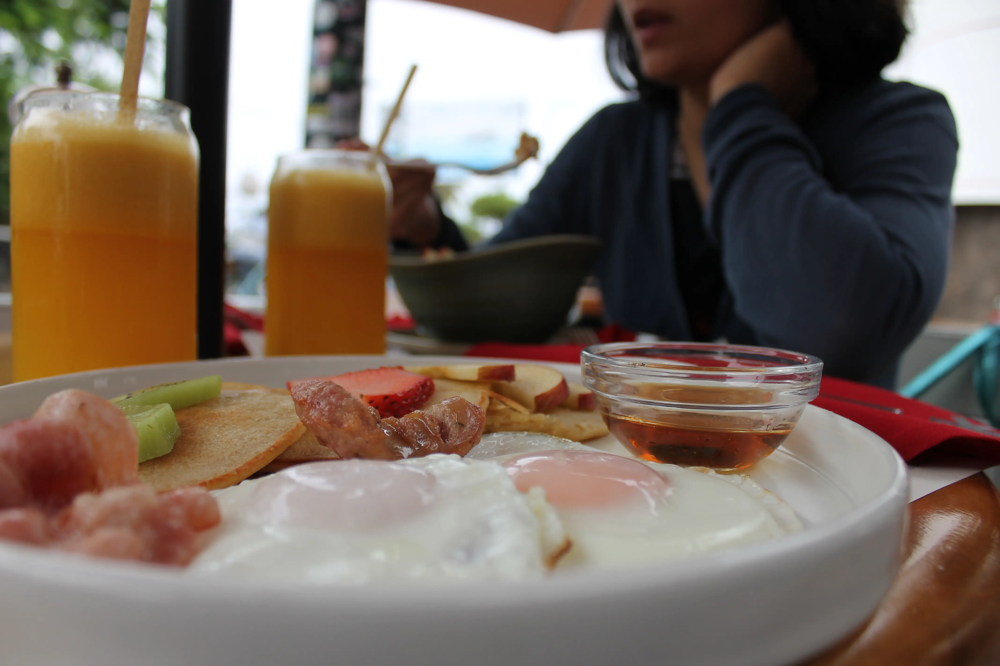
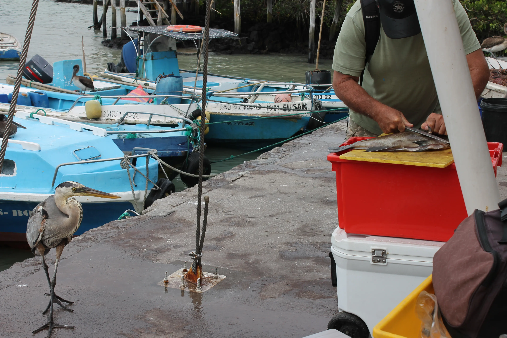
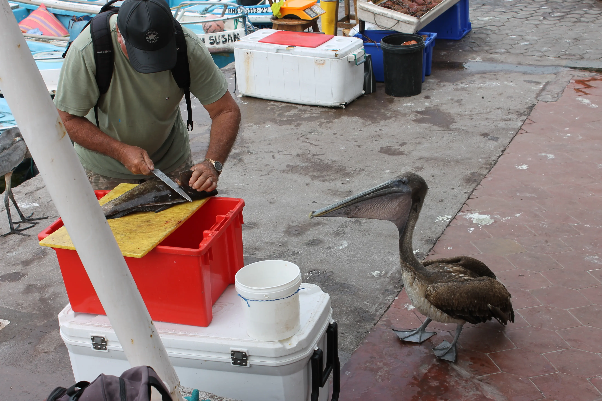
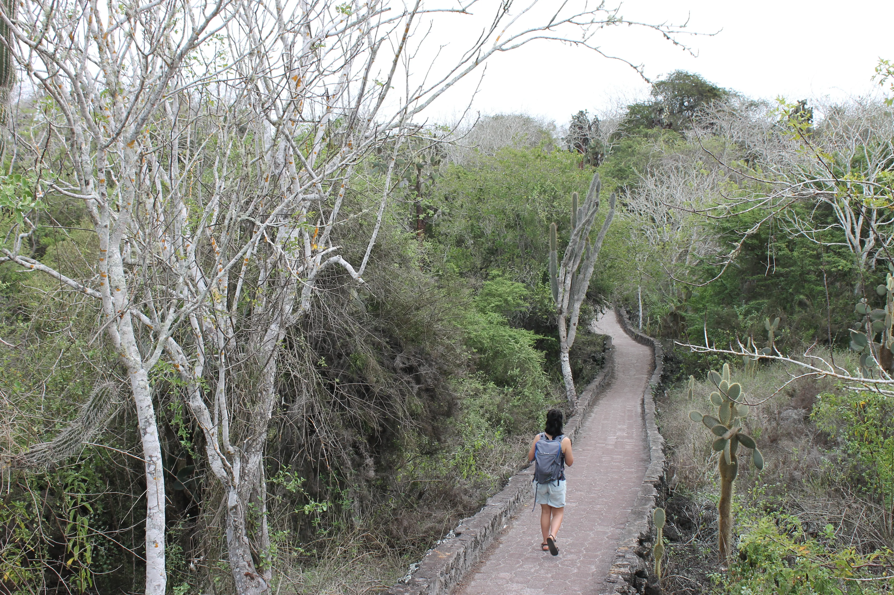
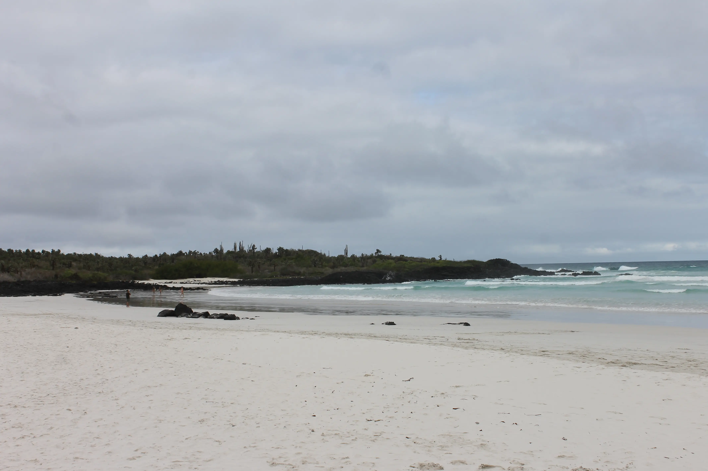
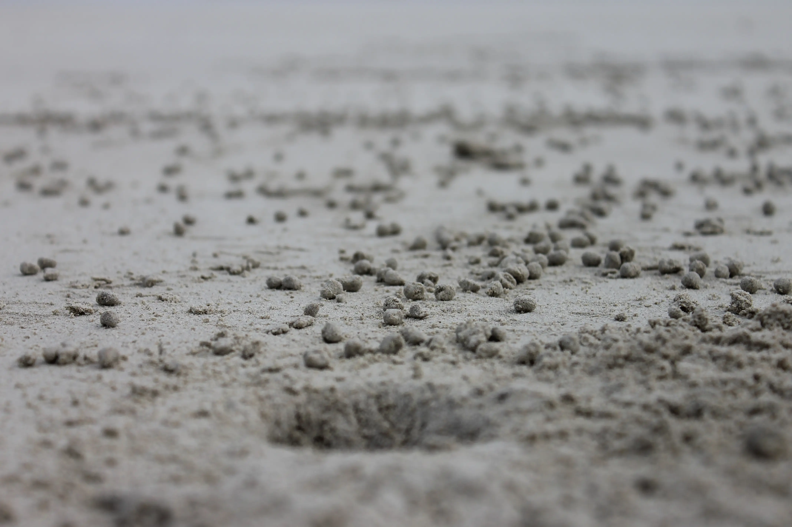
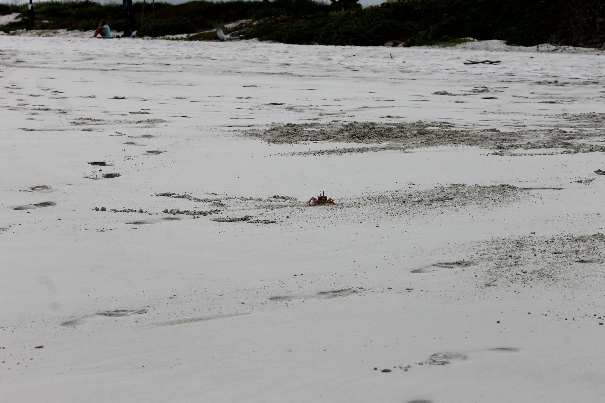
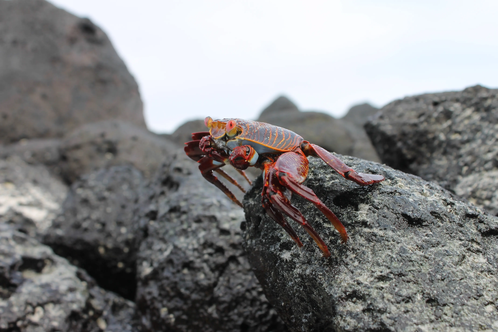
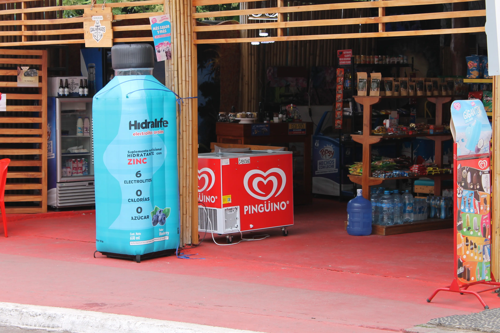

---
# Giorno 18 - Santa Cruz
Arrivederci Isabela, alle 4:45 siamo pronti per imbarcarci verso Santa Cruz, per poi volare  verso Quito domani.

Oggi ce la prendiamo comoda, e una volta sbarcati, facciamo colazione:

Dopodichè passiamo il resto della mattinata a riposare un po', e dopo pranzo facciamo un giretto per il centro. Ovviamente siamo sempre alla ricerca di animali, per questo ci fermiamo vicino al mercato del pesce, e vediamo alcuni acquirenti abituali:

Proseguiamo prendendo un piccolo sentiero che porta alla [Tortuga Bay](https://maps.app.goo.gl/fTnyCGXaXUYVcWum8):

Eccoci, 40 minuti dopo:

Mentre ci sediamo un pochetto, notiamo che sulla spiaggia ci sono un sacco di piccole tane di granchio:

A volte si vedono fare cucù:

Guardando anche un po' sugli scogli, abbiamo parlato con uno, Ambrogio, che si sentiva particolarmente fotogenico:

Torniamo nel paese, e niente, per oggi è tutto.
A domani, buonanotte (ore 17:22 locali).

## Bonus
Qui a Santa Cruz i gelati non sono marca Algida, ma:

Non abbiamo idea di come si pronunci.

#### Curiosità del giorno
Più andiamo veloci, più siamo pesanti. Se viaggiassimo al 99% della velocità della luce, la nostra massa sarebbe 10 volte maggiore. Al 99.99% della velocità della luce, la massa aumenterebbe di 100 volte.
#### Fatto del giorno
Lo scrittore italiano più famoso al mondo è Carlo Collodi, padre di Pinocchio, il cui libro è stato tradotto in 59 lingue differenti.

