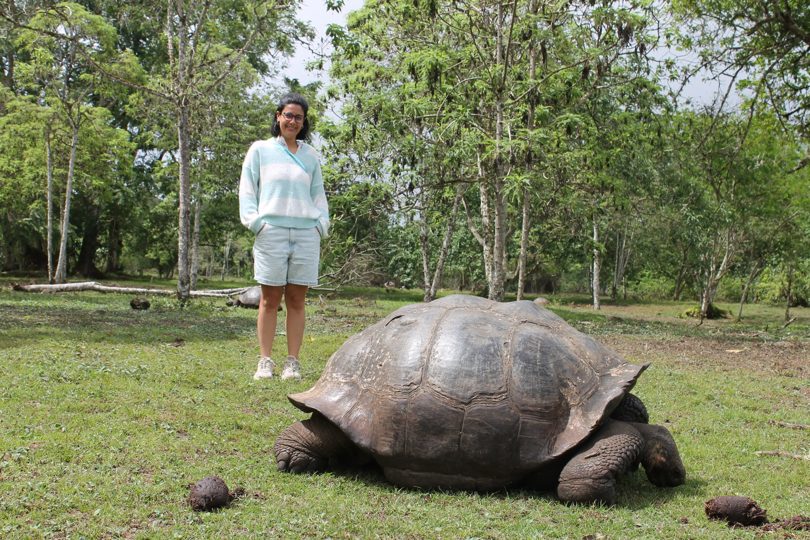
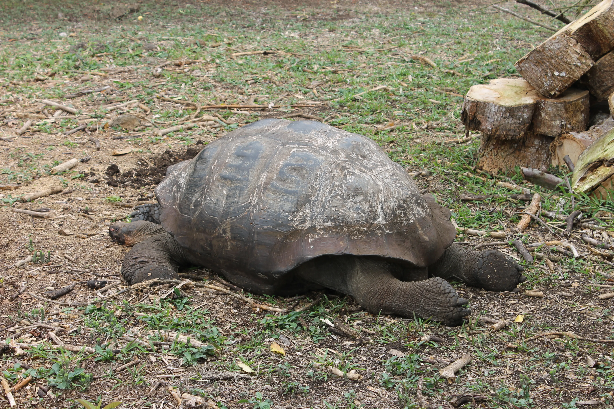
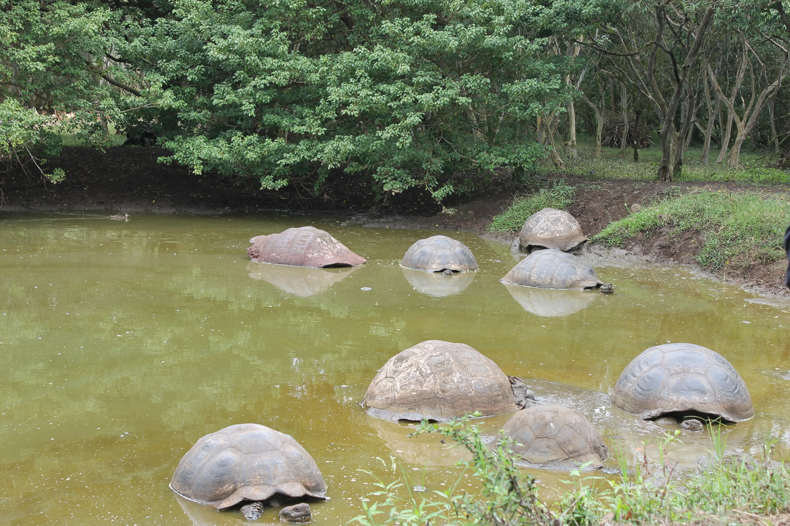
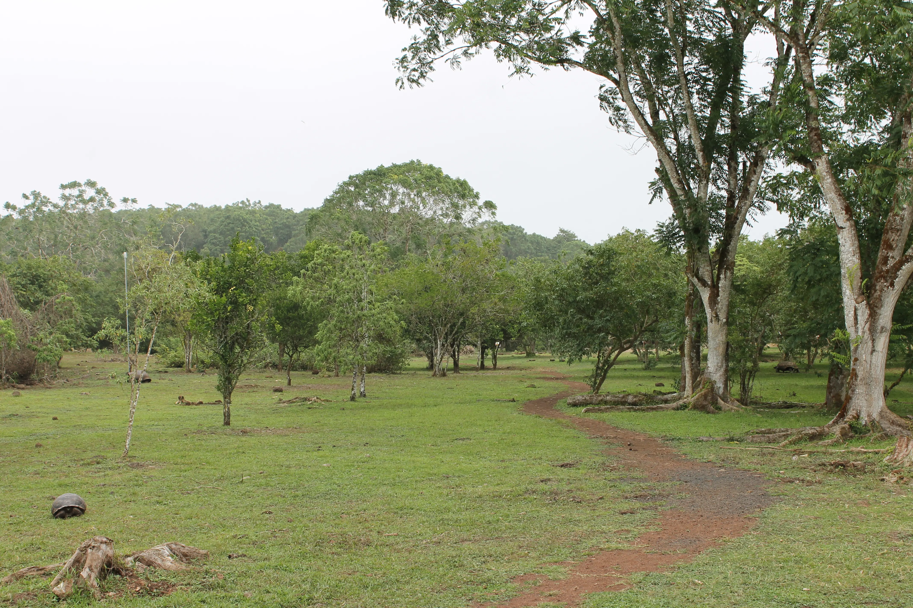
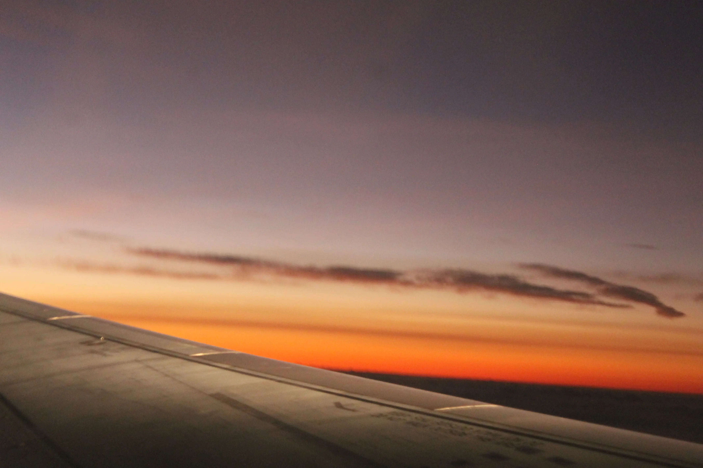
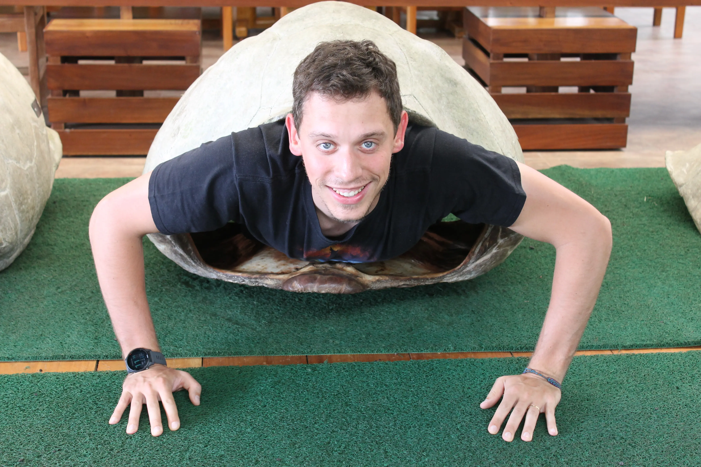

---
# Giorno 19 - Verso Quito
La puntata di oggi la abbiamo pubblicata domattina, perchè siamo arrivati in hotel abbastanza tardi e abbastanza stanchini. Perdonateci 💔.

Arrivederci Galapagos, si torna sulla terraferma. Alle 10 facciamo l'ultima visita programmata di questo viaggio, e andiamo a vedere le tartarughe giganti.

Come tutti sanno, le tartarughe sono nate per correre, infatti queste riescono a fare la bellezza di 1.5km al giorno. Spesso dopo aver fatto qualche metro si prendono una pausa, riposandosi in posizioni molto eleganti:

Ah, gli piace parecchio stare a mollo (per la termoregolazione ovviamente):

Diamo un'ultima occhiata al paesaggio tropicale, e ci rimettiamo in macchina, per andare verso l'aeropuerto.

Da qui in poi è stato un susseguirsi di bus, traghetto, aereo fino a Guayaquil (in cui abbiamo sostato 30 minuti) e poi stesso aereo fino a Quito.
Siccome siamo alternativi, ecco una foto dell'ala al posto che del tramonto:

Siamo arrivati in hotel alle 21, dopo una lunghissima chiacchierata con Julian, il nostro pickup, che ci ha raccontato un sacco di cose sull'Ecuador e ci ha fatto sentire in colpa per non essere stati qualche giorno in più qui. Gli abbiamo promesso che torniamo.

A stasera, buonanotte (ore 7:22 locali).

## Bonus
Dopo la foto estremamente turistica fatta con la tartaruga marina, non poteva mancare questa:

#### Curiosità del giorno
La densità di massa media dell'universo è di circa 6 protoni al metro cubo. Nel corpo umano ci sono circa 20 000 000 000 000 000 000 000 000 000 protoni. L'universo è grande e vuoto!
#### Fatto del giorno
Si dice che William Shakespeare abbia inventato più di 1000 parole usate correntemente nell'inglese moderno.

