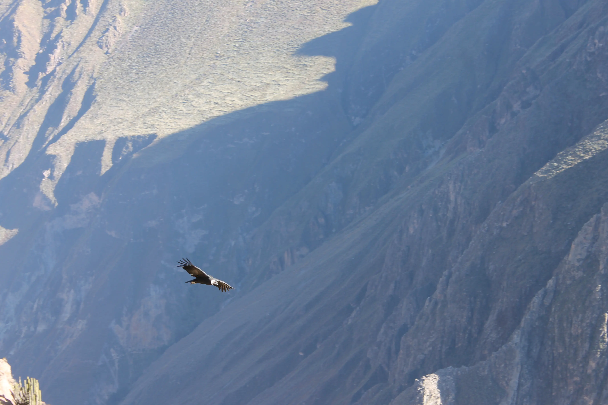
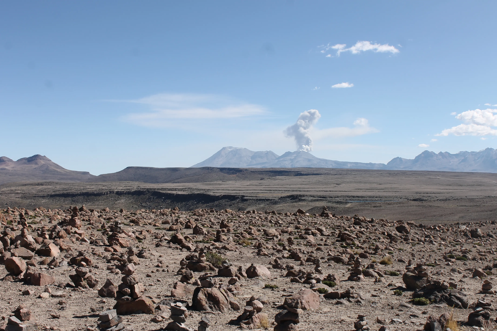
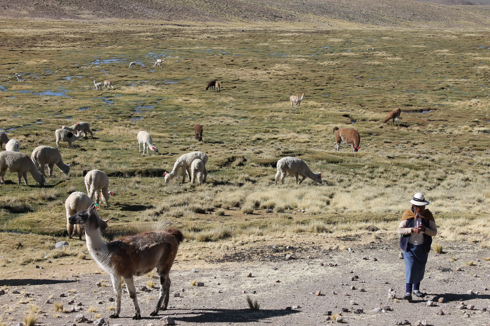
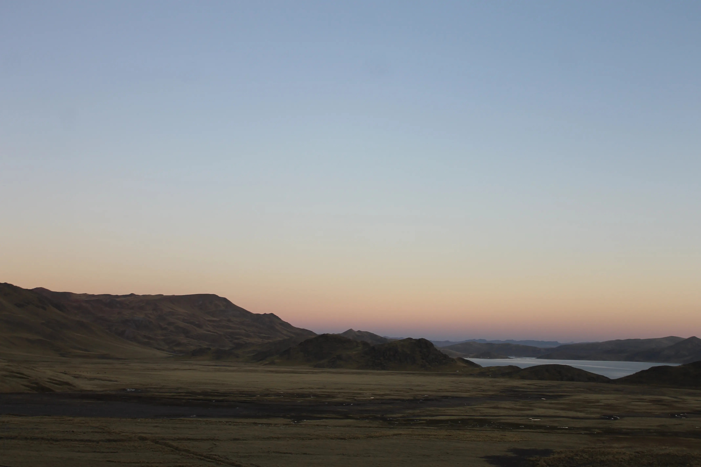

---
# Giorno 7 - Il Camion del Colca
Il settimo giorno noi NON ci riposiamo, anzi, decidiamo di passare la giornata in bus. 
Sveglia abbastanza traumatica alle 5:35; per un qualche motivo oggi facciamo un po' più fatica del solito ad alzarci. Diamo la colpa all'ossigeno rarefatto.

Ah, anche [Hualca Hualca](https://es.wikipedia.org/wiki/Hualca_Hualca) stamattina sbuffa:

## Mañana folkloristica
Saliamo sul bus alle 6:25 accompagnati da Raul, Michael, e varie altre persone che abbiamo conosciuto nei giorni scorsi e che condividono con noi questa tappa del viaggio. Lasciamo Chivay e ci dirigiamo a [Yanque](https://es.wikipedia.org/wiki/Yanque), pronunciato Gianche.

A Yanque assistiamo alla danza [Wititi](https://es.wikipedia.org/wiki/Wititi) fatta dei bimbi della scuola, che ballano dalle 6:20 alle 7:30 tutti i giorni come autofinanziamento.

## El Cañon del Colca
Durante il viaggio facciamo varie pause per fermarci sui *miradores*; nel primo vediamo i terrazzamenti inca, che vengono utilizzati ancora oggi per l'agricoltura:

Qui dobbiamo scusarci, perchè dalle foto non si riesce a capire quanto siano enormi gli spazi. Non sembra per niente un paesaggio a misura d'uomo, sembra che ci abitino i giganti.

Vedete quel piccolo spuntone in alto a sinistra, alla fine dell'altipiano in fondo in fondo? Li nasce il Rio delle Amazzoni.

Arriviamo alla Cruz del Condor, o meglio ci fermiamo poco prima perchè Raul vuole portarci in uno spot privilegiato, senza turisti. 
Bob, il guardiano dei Condor, ci attende lì:

Bob ci assicura che da lì a poco avremmo visto i padroni di casa; dopo poco infatti, eccoli arrivare:

I condor sono dei bestioni. Hanno una apertura alare che raggiunge i 3 metri. 

I condor non volano, planano seguendo le correnti ascensionali. Servono due fattori per vedere un condor: sole e vento. 

*"No sol, no viento, no condor."* [Bob] 

Contenti, decidiamo di fare una passeggiata per raggiungere la Cruz del Condor; il paesaggio oggi assomiglia un po' al far west:

Vi rispiarmiamo il mirador della Cruz del Condor: molto turistico, pieno di gente, non il nostro ambiente ideale.

## Hasta la vista baby
Salutati i condor e i turisti, Michael e Raul ci portano alla fermata del bus per Puno. Durante il tragitto, altri miradores con altri terrazzamenti:

Raul ci consiglia di visitare il Perù ad Aprile, dopo la stagione delle piogge, per vedere il paesaggio molto più verde di così. 

Come ultima tappa del cañon ci fermiamo a [Maca](https://es.wikipedia.org/wiki/Maca_(Caylloma)). Mentre passeggiamo per il centro, ci imbattiamo in [Thor versione inca](https://en.wikipedia.org/wiki/Cahuide): 

In questa gloriosa raffigurazione, sta menando di botte un soldato spagnolo.

A Maca troviamo anche il lama più incredibile che abbiamo visto fino ad ora, il nostro spirito guida

## Gaudi e Rrroy
A questo punto, inizia la fase più assurda, divertente e incoerente della giornata: il viaggio da Maca a Puno. 
Lasciamo Raul e Michael in una valle di lacrime, e al loro posto Gaudi (la guida) e Rrroy (l'autista) ci prendono sotto la loro ala protettrice.

Gaudi è una donna dalle idee chiare: per lei noi turisti siamo estremamente stressati e in preda al panico per questo viaggio, quindi il suo obiettivo è quello di ripetere come un mantra: "NO ESTRESS, TAKE IT EASY CHICOS, RELAX, ENJOY THE TRIP". 
Non ci sarà un singolo secondo nel viaggio in cui non saremo cullati dalla melodiosa voce della nostra guida.

Rrroy è un uomo di poche parole, lui vuole guidare, è stato creato per questo. A Rrroy non importa se sta guidando un maggiolino o un autoarticolato, lo stile è sempre lo stesso. Viaggiare con Rrroy è come essere gettati in un dirupo scosceso legati, bendati e dentro ad un barile.

Dirigendoci verso Puno, ripassiamo per Patapampa, a 4910m. Il bus è un lazzaretto. Assistiamo ad alcuni che crollano per terra in preda a svenimenti selvaggi, altri che corrono in bagno sperando di arrivarci prima che sia troppo tardi, e altri che in bagno non ci arrivano in tempo.  
Fortunatamente, noi siamo seduti davanti così da non avvertire i salti mortali che soffrono i poveri passeggeri di poppa.

Facciamo una passeggiata e (ri)facciamo qualche foto:

Ci era stato promesso che le 6 ore di viaggio avrebbero contenuto solamente 1 pausa, ed ecco la seconda (lama watching):

E la terza (lama petting):

E la quarta:

Questa è in realtà interessante, queste lagunillas (4413m s.l.m) sono addirittura più in alto del lago Titikaka.

Sorvoliamo sulle altre pause tecniche, e proseguiamo con il viaggio. Sono ormai le 17:30, e il sole cala:

Arriviamo a Puno alle 19. Prima di scendere, Gaudi ci ricorda gentilmente 5 volte di non dimenticare assolutamente nulla, e procede a dirci la lista di cose da non perdere, in italiano e in spagnolo. 

## Buonanotte
A domani, buonanotte (ore 21:40 locali, 3950m s.l.m.).
Probabilmente il resoconto di domani arriverà il giorno dopo, dato che al lago Titikaka non c'è acqua, luce o internet.

## Bonus
Non ci siamo dimenticati del tramonto; eccolo, anche se ritratto dal bus:

#### Curiosità del giorno
Al CERN, su duecento miliardi di protoni che vengono sparati gli uni contro gli altri, meno di 100 si scontrano per davvero.
#### Fatto del giorno
Ci sono 4 milioni di persone in brasile che parlano correntemente dialetto veneto.

