---
# Giorno 8 - Il lago Chitikaka
Questa mattina ci siamo svegliati come solito di buon ora (6:20) per partire alla volta del lago Titikaka (pronuncia: "titihaha", come se fossimo toscani) e la prima tappa del nostro viaggio in barca è stata la visita alla comunità degli Uros.  
Gli Uros sono una popolazione inca che ancora oggi sopravvive sul lago, vivendo su isole fluttuanti fatte di canne di papiro. 
Tutto questo potrebbe sembrare interessante, ma in realtà è una esperienza che noi personalmente non raccomandiamo per due semplici motivi: 
1. si tratta di una visita costruita appositamente per i turisti, dove fatichiamo a stabilire un contatto con le persone o a trovare qualcosa di vero o genuino. 
2. i bambini sono parte attiva dello show, e vengono sballottati qui e là come mascotte.

Capiamo che il turismo è una componente importante dell'economia locale, ma noi preferiamo far girare l'economia a modo nostro; ci siamo sentiti un po' come una mandria di mucche, incanalati verso vari mercatini e/o performance di intrattenimento. C'è senza dubbio a chi piace, noi ci riserviamo di disserntire :)

## Taquile
Fortunatamente il nostro viaggio prosegue e arriviamo per ora di pranzo a Taquile, l'isola piu importante qui sul lago, con una popolazione di circa 2500 persone. 

Ci accoglie una passeggiata di 150 metri di dislivello per raggiungere la plaza principale. Ricordiamo ai gentili telespettatori che la passeggiata si svolge a 4000 metri sul livello del mare. 
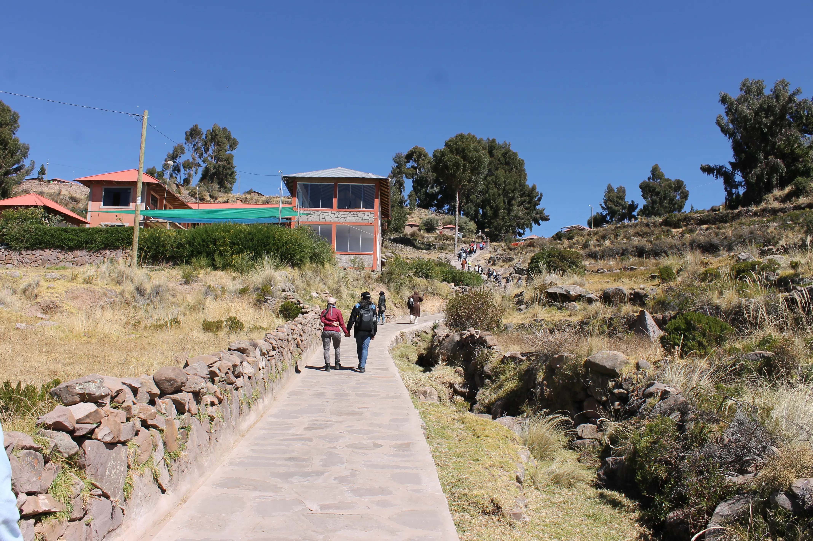

30 minuti, e 165 battiti di media più tardi arriviamo in cima sani e salvi; ci aspetta una spledida vista sul lago, che continuiamo a scambiare per il mare:
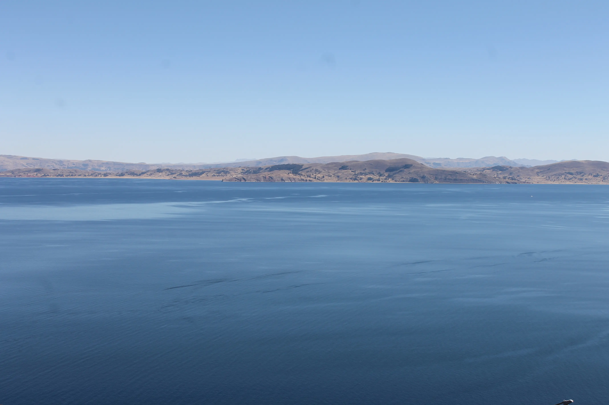
e un ottimo pranzo a base di zuppa di quinoa (il cereale andino per eccellenza) e trota con patate; tutto prodotto, pescato e raccolto qui:
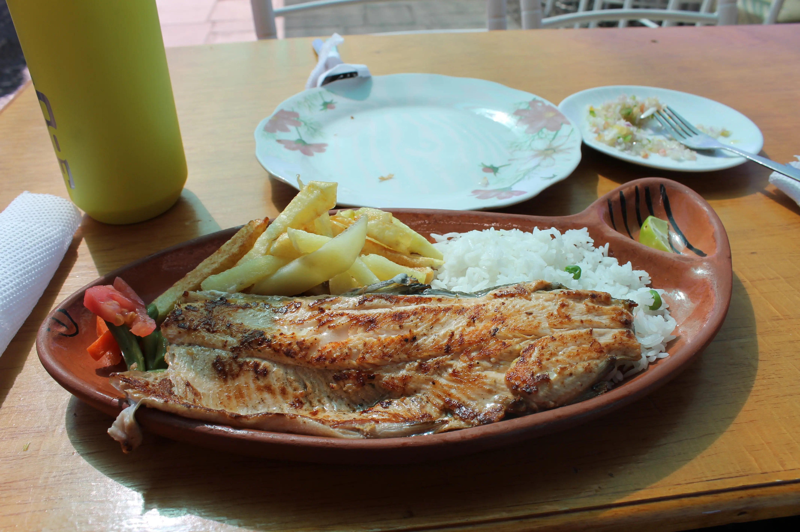

Conosciamo anche Johnny, che ci accompagna per la giornata di oggi e soprattutto ci ospita nella casa della sua famiglia fino a domani.  Johnny è un ragazzo di 27 anni, un ragazzo timido e gentile; piano piano si apre e ci inizia a raccontare la sua vita qua sul lago.  

Johnny è un nostro coetaneo, ma questo posto e casa nostra sono luoghi cosi differenti e le nostre vite sembrano due mondi distinti. 
Lui è sposato e ha una bambina bellissima di 4 anni, il suo matrimonio (che ci racconta per filo e per segno) è durato 5 giorni, come da tradizione. Altro che noi pivelli che sudiamo mesi per organizzare una sola giornata. 
Mentre ci racconta tutte queste cose, passeggiamo:
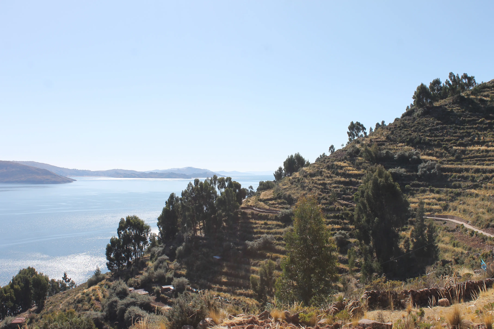

## Una allegra scampagnata
Jhonny non ce lo dice, ma vuole farci diventare degli sherpa professionisti, quindi decide che oggi arriviamo nel punto più alto dell'isola. Inizia qui una escursione di altri 200m di dislivello, che ci porterà a 4180m.
Ecco Jhonny scorrazzare allegro come uno stambecco fra le pietre, mentre noi disperati arranchiamo:
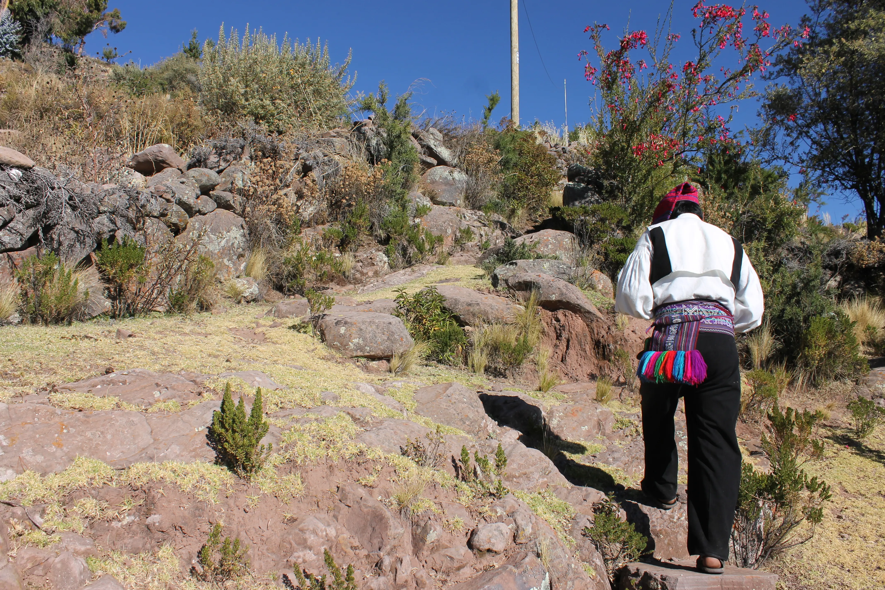

Spesso dimentichiamo di essere su un lago, e di essere a 4000m:
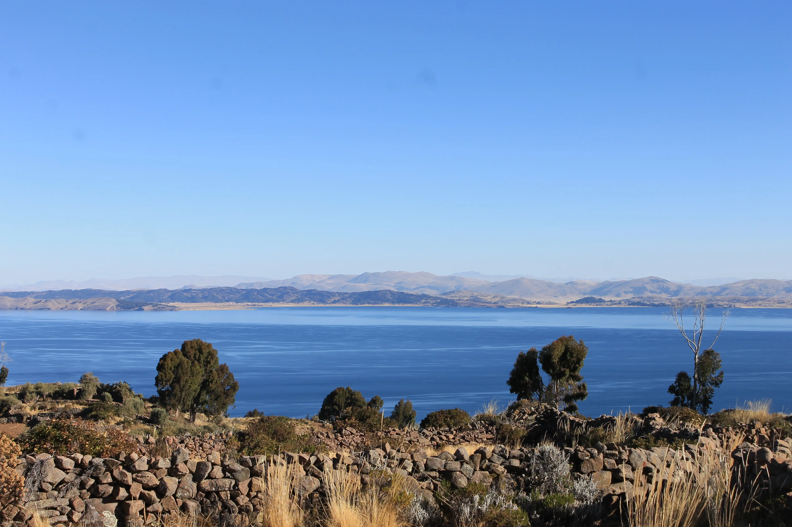

Arriviamo in cima, nel tempio della Pacha Mama (la madre terra):
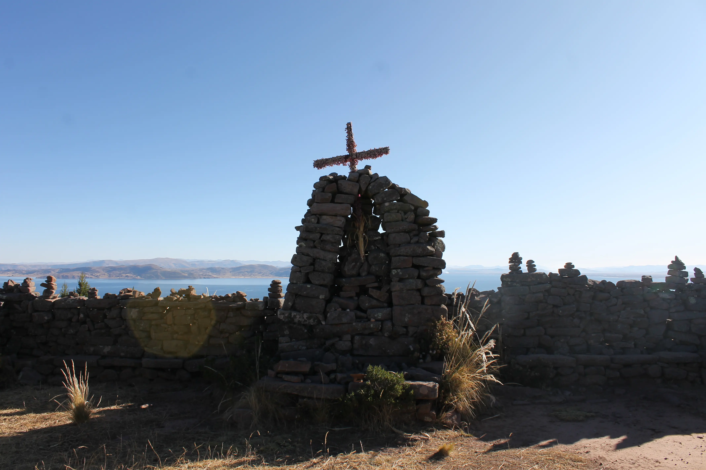

Da qui riusciamo a vedere una buona parte di Taquile:
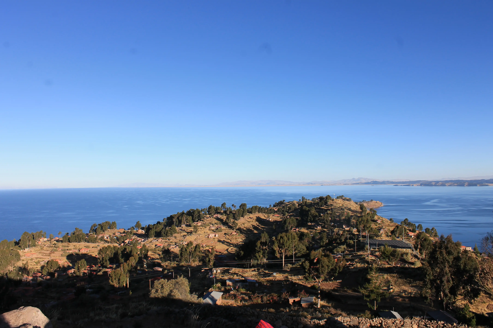

Mentre andiamo a vedere il tramonto, incontriamo alcuni dei vicini:
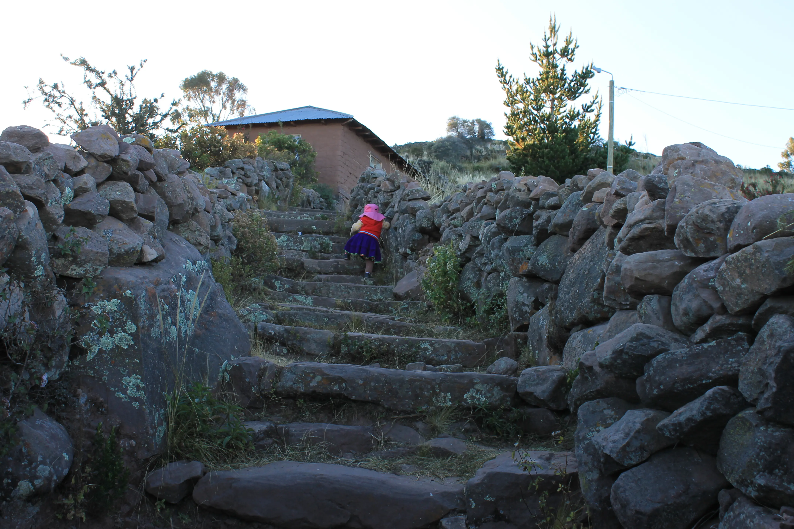

E alle 17:22, il tramonto su Tequila:
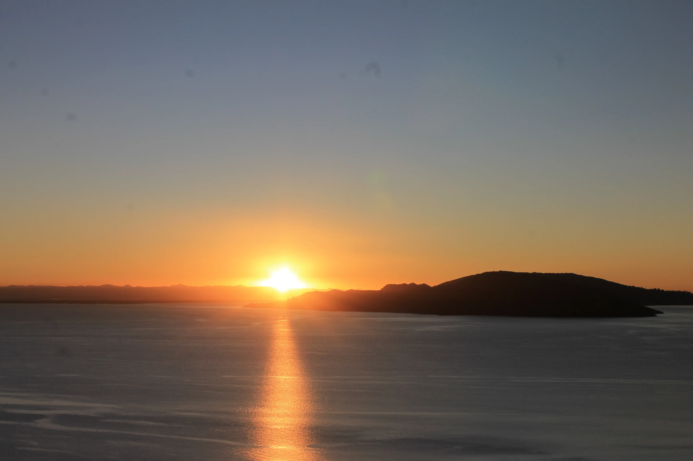

Stiamo scrivendo dalla camera (sono le 19:20), in attesa di cenare con la famiglia.  
La temperatura è -20 gradi Kelvin, ma i 4 panni e il piumone ci aiutano. 
Ciao.

## Bonus
A pranzo hanno visto che eravamo un po' nostalgici, quindi ci hanno portato il gnocco fritto:
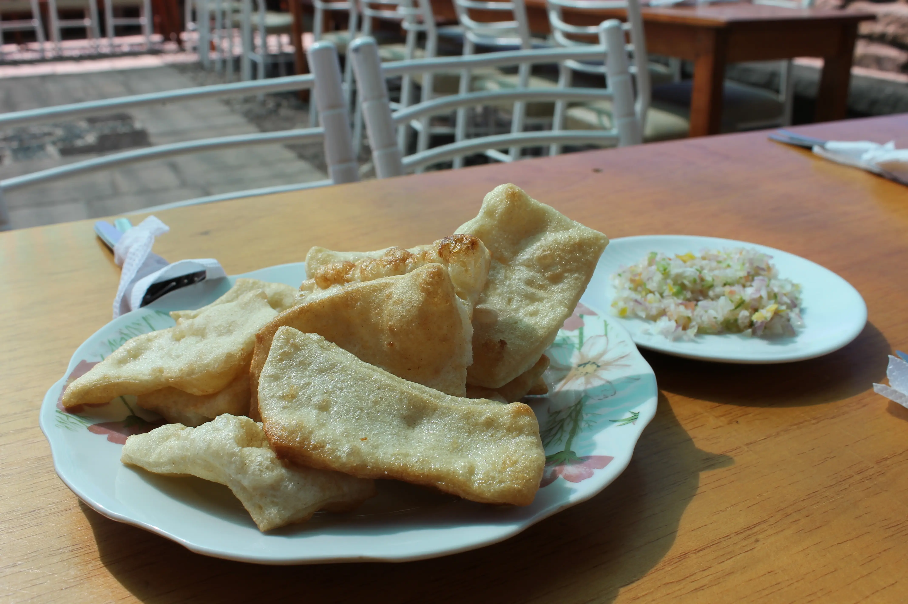

#### Curiosità del giorno
Se mai incontrerete qualcuno fatto di antimateria, NON stringetevi la mano.
#### Fatto del giorno
I comuni con il nome più corto in Italia sono Lu (AL), Ne (GE), Mù (BS).

