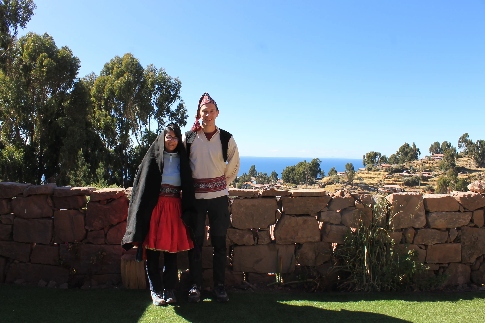
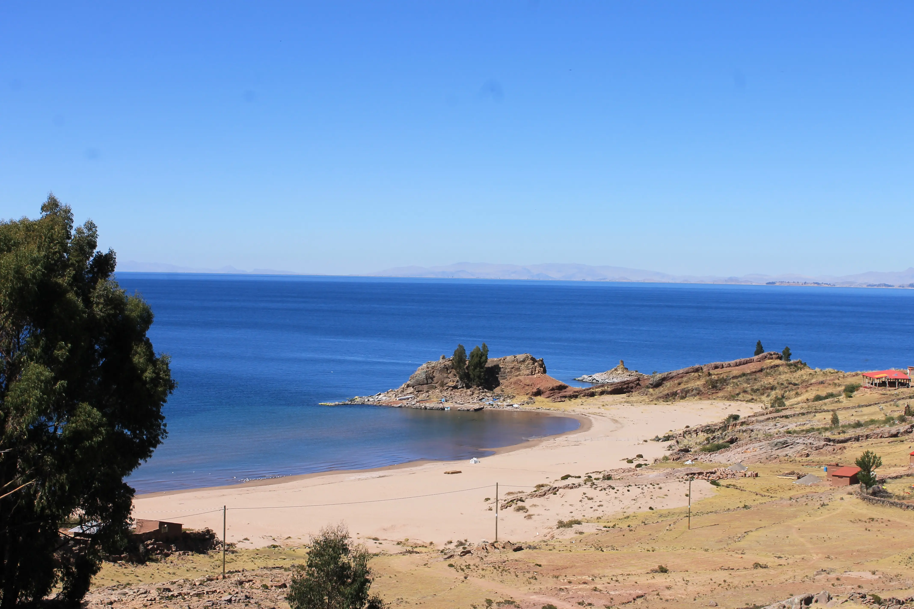
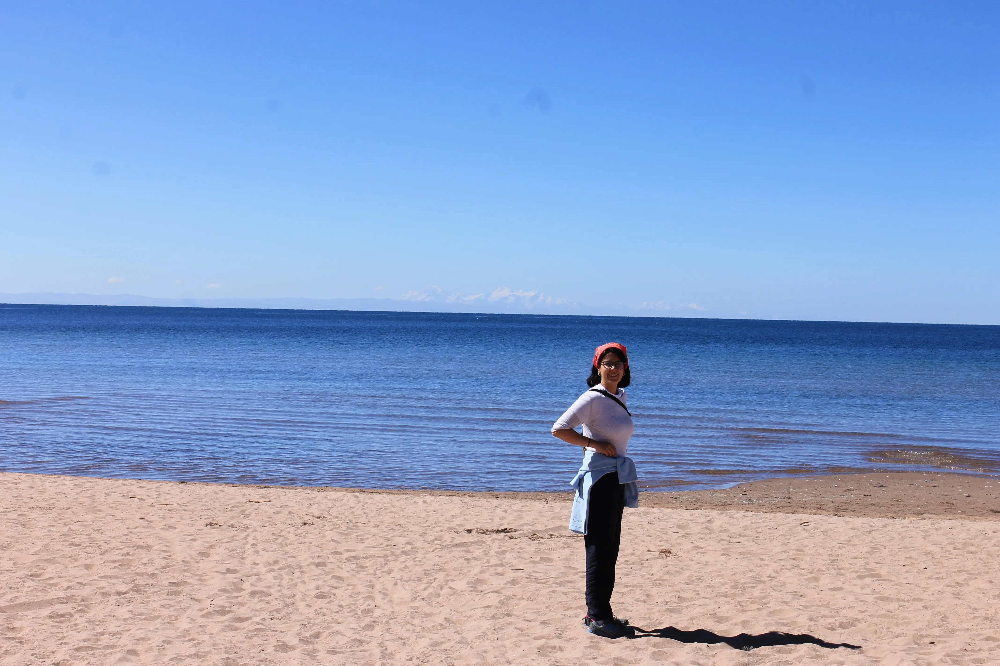
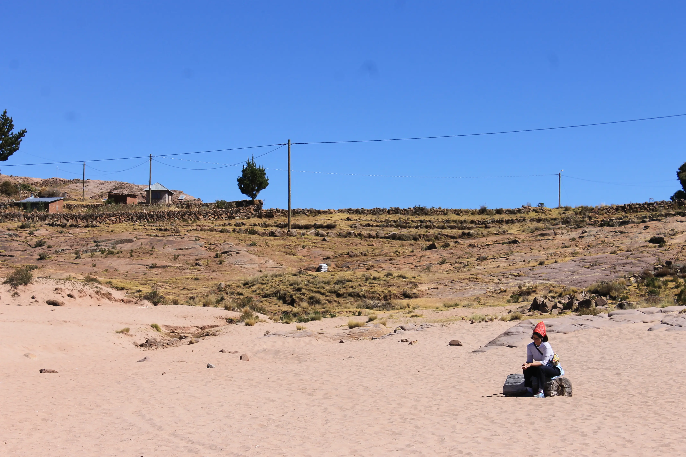
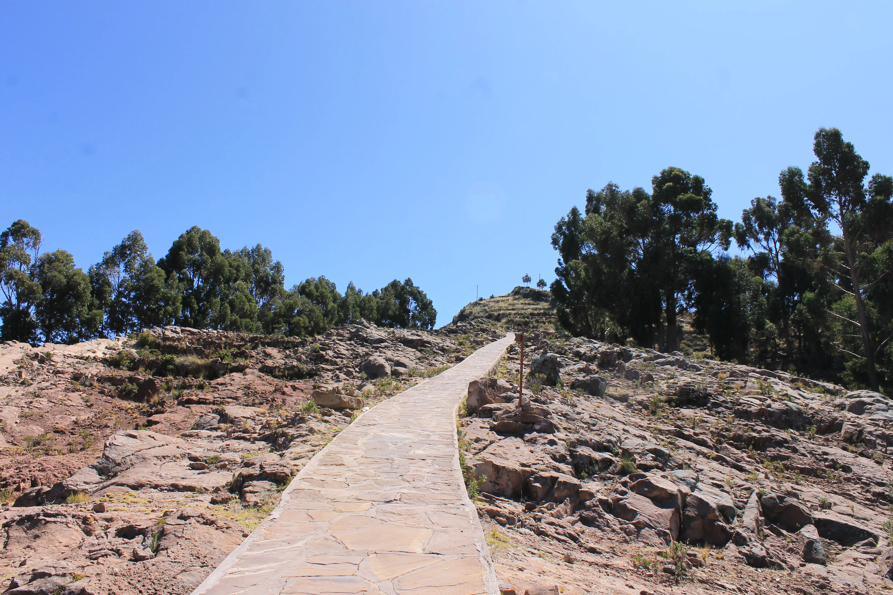
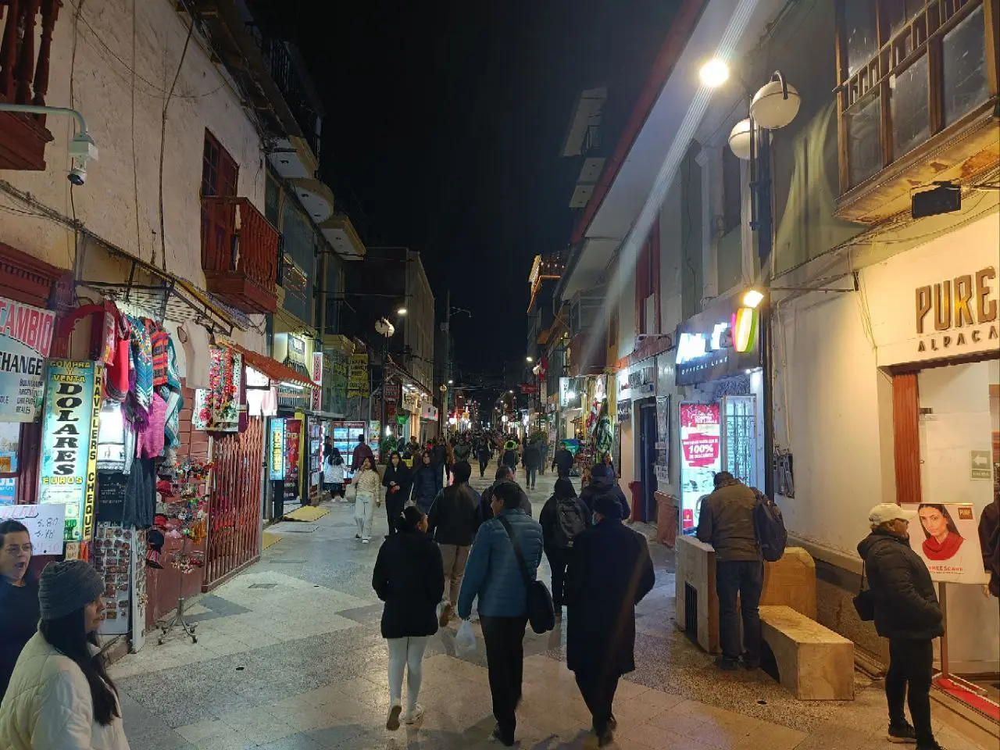
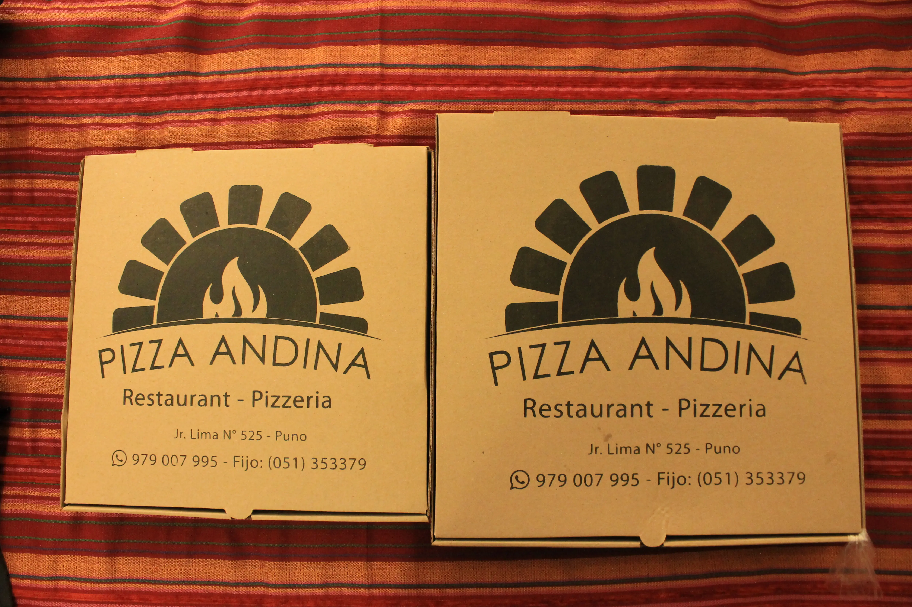

---
# Giorno 9 - Tequila parte dos
La nottata poteva sembrare drammatica, ma dopo la cena straordinaria che abbiamo avuto con Cecilio, il padrone di casa, eravamo caldi e carichi per affrontare il gelo che si ha in mezzo all'acqua a 4000m di notte.

Ci siamo svegliati con il sole, alle 6:20, e abbiamo fatto colazione con Cecilio: gnocco fritto e pancake. Wow. 
Durante il resto della mattinata abbiamo prima di tutto imparato un po' di storia della isola di Taquile, ma soprattutto i 3 principi inca che la popolazione utilizza come regole comunitarie:
1. ama sua: non rubare
2. ama llulla: non mentire
3. ama qhilla: non essere pigri

Ci ha colpito la filosofia di questo popolo che cerca di mantenere le proprie tradizioni e costumi intatti, combattendo il turismo selvaggio. Infatti, non tutti i turisti passano la notte a Taquile, la maggior parte arrivano fino alla piazza principale, e poi vengono gentilmente riaccompagnati alla barca, per non rompere troppo le scatole agli abitanti.

Cercano di mantenere una agricoltura il più naturale possibile, la loro economia è tendenzialmente circolare, non usano quasi mai il denaro fra di loro ma usano il baratto, lavorando insieme per il bene di tutti.

Sono l'unica popolazione nel lago che mantiene gli indumenti tradizionali, e ne vanno fieri. Talmente fieri che trovano il modo di infilare Giovanni e l'Elisa in uno degli abiti tradizionali:

E come ultima cosa: fanno festa, almeno una volta al mese, con balli ed eventi comunitari.

Poco prima di salutarci, Jhonny ci fa sperimentare una ultima emozione, camminare attraverso tutta l'isola per arrivare alla spiaggia. 1 ora all'andata (in discesa), e 1 ora al ritorno (non in discesa). Abbiamo registrato la nostra performace durante il ritorno, per chi fosse interessato [ecco qua il sommario](https://connect.garmin.com/modern/activity/16229670743?share_unique_id=3). 
Ormai siamo dei bomber, abbiamo deciso che ad agosto proviamo l'Everest.

Ci dobbiamo ricordare spesso che questo non è il mare, anche se a noi ricorda molto la Croazia.

L'unica cosa che ci riporta con i piedi per terra sono le Ande sullo sfondo:

Esatto, quelle sullo sfondo non sono nuvole, è neve! E siamo a 3800 m.

Ci prendiamo ancora qualche momento per riflettere su dove siamo finiti:

Per poi dirigerci verso la piazza principale per lasciare l'isola:

Mentre lasciamo la casa di Cecilio, promettiamo che lo aiuteremo a promuovere (responsabilmente) questa esperiena che dà l'opportunità alle persone di condividere qualche giorno in un luogo che resta quasi incontaminato dal turismo mordi e fuggi. 
Fra qualche mese date una occhiata a http://titicacataquile.com.

Siamo stati privilegiati ad essere praticamente i soli turisti ad essere andati oltre la piazza principale, ma di questo ce ne siamo accorti appena prima di salire sulla barca per Puno.

## Puno again
Torniamo a Puno e ci svacchiamo in camera. Questi giorni sono stati belli tosti.  
Facciamo giusto due passi per il centro:

A domani, buonanotte (ore 21:00 locali). 
Ciao.

## Bonus
Il tono di questa puntata del diario [difetta](https://www.treccani.it/vocabolario/difettare/) un poco della solita comicità grottesca. Per rimediare, abbiamo deciso di commettere un errore grosso:

Sissignore. 

#### Curiosità del giorno
C'è la (molto molto molto) remota possibilità che lanciando una palla contro un muro, questa lo attraversi
#### Fatto del giorno
Tasso era ossessionato dalla privacy, tanto che in un'occasione aggredì un servitore sospettato di averlo spiato.

